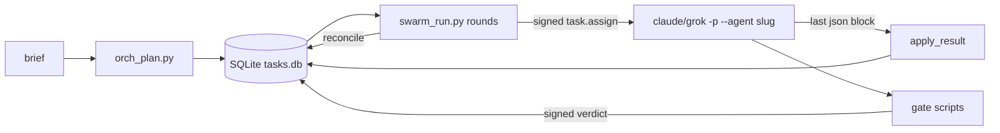

# Repository Guidelines

## Project Overview

AgentSwarm contains two things:

- **Design spec** for a 15-agent SDLC swarm, A01 ORCH through A15 DOC: `01-*.md` … `07-*.md` and `03-agents/`.
- **Runnable implementation:**
  - `swarm/` — Python runtime: signed envelopes, a SQLite task state machine, and gates.
  - `scripts/` — per-agent CLI tools, each with a Bun TypeScript twin.
  - Generated subagent definitions for Claude Code, Grok Build, Trae SOLO and omp.

`scripts/swarm_run.py` drives headless `claude -p --agent <slug>` or `grok -p --agent <slug>` sessions against a target repo. This is not a library or a service.

## Architecture & Data Flow



**1. Plan** — `orch_plan.py`
- Turns a brief into a DAG, either from `PATTERNS` (feature = 13 tasks, hotfix = 8, dependency = 8) or from `--pattern custom --plan plan.json`.
- Writes rows to `$SWARM_DIR/tasks.db`, plus `plans/<corr>.json` and `latest_correlation`.

**2. Run** — `swarm_run.py` loops in rounds of `reconcile()` → `dispatchable()` → `execute_one()`.
- Each round runs a `ThreadPoolExecutor(--max-parallel)` with one SQLite connection per thread.
- For each task it writes a signed `task.assign` to `assignments/` and saves output to `results/<tid>.a<N>.md`.
- Claude runs with cwd set to this repo and `--add-dir <repo>`.
- Grok runs with `--cwd <repo> --yolo`.

**3. Result protocol**
- The agent's **last** ```json block is parsed: `{state: IN_REVIEW|BLOCKED|FAILED, outputs[], verdicts{target:{verdict,findings}}}`.
- `apply_result()` records artifacts and verdicts.

**4. Gates** — `qa_gate.py` (quality), `rev_gate.py` (review), `sec_gate.py` (security), `rel_plan.py` (release)
- Each calls `make_verdict`, which signs the verdict.
- Each writes `verdicts/<task>.<gate>.json` and calls `TaskStore.record_verdict`.

**5. Reconcile**
- If any required gate fails: CHANGES_REQUESTED, then a rework back to IN_PROGRESS. Gate tasks are re-created as `<gate-id>.r<N>`.
- The 3rd failure (`MAX_REWORK_LOOPS=2`) moves the task to ESCALATED and emits an `escalation.request` event.
- All required gates pass or waive (unexpired, issued after the last rework): APPROVED, then DONE.

**State machine** (`swarm/taskstore.py`: `TaskState`, `LEGAL_TRANSITIONS`)
- States: CREATED → VALIDATED → PLANNED → CLAIMED → IN_PROGRESS → IN_REVIEW → APPROVED → DONE, plus BLOCKED, FAILED, RETRY, CHANGES_REQUESTED, ESCALATED, CANCELLED.
- An illegal transition raises `SwarmError`.
- A move to APPROVED is refused (fail-closed) while `missing_gates()` is non-empty.
- A dependency counts as satisfied once it reaches IN_REVIEW, APPROVED or DONE.

**Gates by risk** (`GATES_BY_RISK`)
- low → review
- medium → review, quality
- high → review, quality, security, release
- `notes.gates` overrides the list; `[]` means no gates.
- Within one gate, the **latest** verdict wins (`latest_verdicts`). Across gates, the results are ANDed.
- A verdict expires after 86400 s; review verdicts after 172800 s.
- Gate scripts record verdict rows only for a leased (IN_PROGRESS) gate task, one per `notes.gate_for` target, each signed with the target's correlation. A `--correlation-id` of another plan exits 2 E-POLICY with no rows.
- `--dry-run` verdicts are signed `dry_run: true`. They are recorded only for a gate task that `swarm_run --dry-run` dispatched (`notes.dry_run`, written by A01 only) and count only on targets it dispatched the same way.

**Signing** (`swarm/envelope.py`)
- Ed25519 when `SWARM_ED25519_KEY` (hex seed) is set and `cryptography` imports.
- Otherwise HMAC-SHA256 with `SWARM_SIGNING_KEY`, defaulting to `dev-insecure-key`. Every dev-key signing emits a `security.dev_key` event into the caller's resolved state dir, except a gate-script preview inside an agent session (`SWARM_AGENT_SESSION=1`), which records nothing and emits only `gate.verdict.unrecorded`.
- Signatures are prefixed `ed25519:` or `hmac:`.
- Envelope schema is `swarm.v1.<type>`.
- `missing_gates()` verifies each required verdict's signed envelope before APPROVED. `missing_gate_reasons` (`orch_status --history`) names why a gate is missing: `absent`, `unsigned`, `bad-sig` (malformed or forged), `mismatch` (row, task or correlation disagree), `stale` (signed before the last rework, even if re-inserted), `dry-run`, `fail`, `expired`.
- A dev-key `hmac:` signature never verifies while `SWARM_ED25519_KEY` is set (even if unloadable) or `SWARM_REQUIRE_KEY=1`.
- `SWARM_REQUIRE_KEY=1` without a real key fails APPROVED closed (E-POLICY). Gate scripts exit 2 with an explicit key-configuration error under a missing or unloadable key.

**Hooks**
- `hooks/user_prompt_submit.py` (Claude Code UserPromptSubmit)
  - Fail-open: always exits 0.
  - Emits `{"additionalContext": …}` only on **SDLC-shaped** prompts (build, implement, add, create, fix, refactor, migrate, deploy, release, ship, write tests, set up, integrate, scaffold, upgrade). Silent for questions (interrogative start, trailing `?`, explain/describe), trivial edits (typo, leading rename), prompts starting with `/` or `<system-reminder`, and prompts containing `/uplift`, `/think`, `explain only`, `/all-in-one:` or `[agent-swarm:dispatch]`.
  - `tests/fixtures/classifier_prompts.json` (`{positive, negative}`) is the shared contract: `tests/test_hook.py` and `omp/test/hooks.test.ts` both read it, so the Python and TS classifiers cannot drift.
  - Emits `{}` when `SWARM_CHILD=1`.
- **omp extension hooks** (`omp/src/index.ts` registers them; the same classifier and identity rules as above)
  - Identity: the session's `session_init.agent`, else env `SWARM_AGENT` (headless `-p` only; `omp/src/context.ts` `callingAgent`). A *swarm session* is one of the 15 slugs, or a top-level session with `SWARM_AGENT` or `SWARM_TASK_ID` set.
  - HOOK-01 `before_agent_start` (`omp/src/hooks.ts`): appends a `## AgentSwarm` system-prompt part pointing at `/swarm <brief>` and `task` with `agent: "a01-orchestrator"`. Silent in subagents (any `session_init`), under `SWARM_CHILD=1` or `SWARM_AGENT`, when the part is already present, and on every non-SDLC prompt above; a classifier throw leaves the prompt untouched; it never spawns.
  - HOOK-02 autonomy ceiling (`tool_call`, swarm sessions only): the ordered rule table `RULES` in `omp/src/guard.ts` matches normalized `bash` commands (leading `env X=…`/`sudo`/`command` stripped; split on `;`, `&&`, `||`, `|`, newline and `$(…)` outside quotes). A hit blocks with `BLOCKED needs: human-approval (<capability>: <rule id>)`. Universal `destructive` rows: `git-force-push`, `git-reset-hard`, `git-clean-force`, `git-branch-force-delete`, `git-discard-repo`, `rm-rf-protected`, `chmod-777-recursive`. A07 `destructive_ddl`: `ddl-drop-truncate`, `prisma-migrate-reset`, `db-push-accept-data-loss`. A11 `prod_infra`: `terraform-apply-destroy`, `pulumi-up-destroy`, `helm-release-change`, `kubectl-prod-change`, `cloud-destructive`. A12 `prod_high_risk`: `vercel-prod`, `fly-deploy`, `gh-release-create`, `package-publish`, `docker-push`, `git-push-protected`. Prod markers are fixed in `PROD_MARKERS` (`prod`, `production`, `--prod`, `main`, `master`, release tags), never configured in `agents.json`; `kubectl apply -f k.yaml` passes, `-n production` blocks.
  - HOOK-03 swarm state (every session, the identity-less main session included): `swarm_transition` and `swarm_ingest` from anyone but `a01-orchestrator` block with `BLOCKED needs: human-approval (swarm-state)`. The shell twin `orch-state-shell` blocks non-A01 swarm agents running `scripts/orch_status.py --ingest|--transition`, `scripts/orch_plan.py` or `scripts/ts/orch_*`; `gate-script-foreign` blocks a `*_gate.py|ts` / `rel_plan` run by any swarm agent but that gate's owner (`GATE_AGENTS`).
  - HOOK-04 depth cap: `a01-orchestrator` without the `task` tool (not in plan mode, not a restricted child) can only `yield` `{state: "BLOCKED", needs: "depth"}`; every other call is blocked with a reason starting `BLOCKED needs: depth`. A guard error blocks inside a swarm session (`BLOCKED needs: human-approval (guard error: …)`) and is ignored outside one.
  - D-08 hardening (swarm sessions): `eval` is blocked outright (`eval-in-swarm`); `write`/`edit` into `.swarm/`, `.omp/` or `~/.omp` block (`protected-path-write`) in every edit mode — `path`/`file_path`, hashline `[path#TAG]` headers and `MV` rows, apply_patch `*** Add|Update|Delete File:` / `*** Move to:` directives, and the `paths` of a `write` to `xd://ast_edit` — as do shell redirections, `tee`, `cp`/`mv`/`install` targets there (`protected-path-shell`).
  - `/swarm <brief> [--pattern=feature|hotfix|dependency] [--risk=low|medium|high]` (`omp/src/commands.ts`): plans the brief through the same bridge and argv as `swarm_plan` (defaults feature / medium) under a deterministic `--correlation-id` (a uuid5 of pattern, risk class and the trimmed brief, fixed namespace in `commands.ts`), then sends a `[agent-swarm:dispatch]` prompt that makes the session call `task` once with `a01-orchestrator` and a `task.assign` payload `{correlation_id, capability: "plan.execute", ready_tasks}` (the plan's tasks with an empty `depends_on`), and awaits `waitForIdle` so a `-p` run finishes the A01 turn. An empty brief or bad flag shows usage; plan mode refuses with E-POLICY; an `E-CONTRACT` conflict shows the `orch_plan` hint. Nothing is dispatched without a successful plan. Re-running the same brief, pattern and risk class hits the same correlation and derived prefix, so `orch_plan` returns the existing plan (`reused: true`, no writes); any other brief, pattern or risk class gets its own correlation and a fresh plan (`orch_plan`'s 4→6 hex prefix fallback still covers a prefix already used by another correlation).
  - Phase 5 (A01 dispatcher skill): a child ending with `SUBAGENT_WARNING_MISSING_YIELD` is ingested as FAILED or BLOCKED, never IN_REVIEW.
  - Residuals (accepted, not closable in-process): the bash rules are regexes over the command text, so `python3 -c …`, `base64 | sh`, `bash -c "$VAR"` and heredoc scripts evade them; raw `eval` code bypasses `tool_call` (hence the outright block; no agent is granted `eval`); AR-04 key custody stays open (in-process subagents share the operator's uid, env and `.swarm/` keys — the path rules are defence in depth only; a per-agent uid or container is Phase 6/7); L3 capabilities that are not shell-visible (scope_change, breaking_contract, brand_change, public_docs, contract/design deviation, major_bump, waive, accept_risk) remain prompt- and gate-enforced only.
  - Self-containment: `omp/src/bridge.ts` and `omp/src/tools.ts` import `../../scripts/ts/script_base.ts`, so a copied `omp/` package breaks; Phase 4 added no new import outside `omp/`, and Phase 7 (install) owns the fix.
- `hooks/autonomous_run.py`
  - Started by an external plugin (`src/swarm/kickoff.ts`, not in this repo).
  - Runs plan and run, with a 120 s dedupe lock at `$SWARM_DIR/kickoffs/<sha16>.lock`.
  - Overwrites `$SWARM_DIR/autonomous.log`.

**Generation pipeline**
- `prompts/` + `agents.json` → `build_agents.py` → `.claude/agents/<slug>.md`, `.grok/agents/<slug>.md`, `omp/agents/<slug>.md` and `omp/skills/<slug>/SKILL.md`
  - `omp/agents/` and `omp/skills/` are generated; `omp/package.json`, `omp/src/` and `omp/test/` are hand-written (see **omp extension package** below).
  - omp `tools:` lists are not a sandbox; the `tool_call` guard above enforces the ceiling, swarm-state and depth rules, and read-only stays unenforced.
- `prompts/` + `agents.json` → `build_trae_agents.py` → `.trae/`: 15 XML prompts of at most 10,000 characters each, `registration.json`, `commands/swarm.md`, `README.md`
- `_write_skills.py` → `skills/<slug>/SKILL.md`, `skills/orchestrate/SKILL.md` and `omp/skills/<slug>/SKILL.md`

**omp extension package** (`omp/`, name `agent-swarm-omp`, no npm dependencies)
- `omp/package.json` declares `omp.extensions: ["./src/index.ts"]`. The entry's factory only registers (five tools, the `/swarm` command, the `session_shutdown`, `before_agent_start` and `tool_call` handlers): no fs calls, spawns or `pi` actions at load (pinned by `omp/test/extension.test.ts`).
- Five typed tools, each `hidden: true` and `loadMode: "essential"`, so a session only gets the ones its agent's `tools:` frontmatter names:
  - A01 only: `swarm_status` (read-only, `orch_status.py`), `swarm_plan` (`orch_plan.py`; patterns feature, hotfix and dependency, no custom DAG), `swarm_ingest` (`orch_status.py --ingest`, the result object is written by the bridge under `$SWARM_DIR/results/`) and `swarm_transition` (`orch_status.py --transition`).
  - A08, A09, A10 and A12 only: `swarm_gate` (qa_gate, rev_gate, sec_gate or rel_plan). It takes findings, never a verdict; the gate script derives and signs one verdict row per target. Each agent runs only its own gate (A08 quality, A09 review, A10 security, A12 release; `GATE_AGENTS` in `omp/src/context.ts`), identified by the session's `session_init` agent or, in headless `-p` sessions, `SWARM_AGENT` (set by `swarm_run.py`); any other caller gets E-POLICY.
  - The grants come from `SWARM_TOOLS` in `build_agents.py` and appear only in `omp/agents/` frontmatter. `render_omp` raises `ValueError` if A01 would get `swarm_gate`, a gate agent anything but `swarm_gate`, or any other agent a `swarm_*` tool.
- Single bridge: every tool call and `/swarm` makes exactly one `runPy` call in `omp/src/bridge.ts`, which spawns `python3 scripts/<script>.py … --json` detached and group-kills it on abort or `session_shutdown` (the command shares the session's in-flight set with the tools). Python holds all logic; TS only builds `--flag=value` argv.
- The four mutating tools and `/swarm` refuse with E-POLICY in omp plan mode, before any spawn or file write. `swarm_status` still works.
- Wiring: the committed `.omp/config.yml` (`extensions: [omp]`) makes `omp/` an extension root, so its tools, agents and skills load into omp sessions **started at the repo root**. omp reads project config from the cwd only and resolves the relative entry against the cwd, so a session started in a subdirectory loads nothing. `.omp/` holds only that file; never also add `.omp/extensions/` or a symlink, which would load the factory twice.
- Swarm runs expect `task.isolation` off: the Task Store resolves from `SWARM_DIR` or the git toplevel of the session cwd, and isolated worktrees would split it.

## Key Directories

| Path | Purpose |
|---|---|
| `swarm/` | Runtime toolkit: `envelope`, `taskstore`, `gates`, `errors`, `script_base`, `runlog`, `manifest` |
| `scripts/` | Per-agent tools (`<lane>_<verb>.py`), orchestration (`orch_plan`, `swarm_run`, `orch_status`) and generators |
| `scripts/ts/` | Bun twins. 14 pass through to Python via `passthrough.ts`. 5 are native **subsets**: `code_checks`, `fe_a11y_check`, `req_lint`, `sec_gate`, `ux_tokens` |
| `prompts/` | **Source of truth** for agent behaviour: XML-tagged system prompts |
| `03-agents/` | Original 7-section agent specs (Purpose, Stack, Communication, Decision logic, Errors, Metrics, Security) |
| `hooks/` | `user_prompt_submit.py` and `autonomous_run.py` |
| `.claude/agents/`, `.grok/agents/`, `.trae/`, `skills/`, `omp/agents/`, `omp/skills/` | **Generated.** Never hand-edit |
| `omp/package.json`, `omp/src/`, `omp/test/` | Hand-written omp extension package (tools, single python bridge, `guard.ts` rule table, `hooks.ts` context hook, `commands.ts` `/swarm`) and its `bun:test` suite |
| `.omp/config.yml` | Committed omp project wiring (`extensions: [omp]`); the only file in `.omp/` |
| `.swarm/` | Runtime state (own `.gitignore` of `*`, written on creation; the repo's `.gitignore` is never touched): `tasks.db`, `events.jsonl`, `plans/`, `assignments/`, `results/`, `verdicts/`, `kickoffs/`, `releases/`, `artifacts/`, `slo/`, `incidents/`, `patch_tasks/` |
| `docs/superpowers/specs/` | Spec for the prompt uplift, TS twins, skills and hooks |

## Development Commands

```bash
# tests
python3 -m pytest                                     # all Python tests (pyproject adds -q)
python3 -m pytest tests/test_swarm.py::test_plan_and_run_dry
bun test tests/ts                                     # root TS suite: tests/ts/*.test.ts (runs no Python tests)
cd omp && bun run test                               # omp package suite: extension.test.ts in its own process, then the rest
ruff check .                                          # py312, E/F/W, E501 ignored; currently 3 pre-existing errors

# regenerate after editing prompts/ or agents.json (run BOTH)
python3 scripts/build_agents.py                       # .claude/agents + .grok/agents + omp/agents + omp/skills   (--check, --only A05,a06-frontend)
python3 scripts/build_trae_agents.py                  # .trae/                          (--check, --dry-run, --json)
python3 scripts/_write_skills.py                      # skills/ + omp/skills/ (overwrites everything; has no --check)
python3 scripts/build_agents.py --install-workspace /path/to/ws   # copy agents, skills and hooks into another workspace

# run the swarm in isolation (SWARM_DIR otherwise defaults to <git toplevel of --root/--repo or cwd>/.swarm)
export SWARM_DIR=/tmp/sw/.swarm                        # this one exported dir is what keeps plan, run and status on the same Task Store
python3 scripts/orch_plan.py --brief-text "Add /health" --pattern feature --risk-class medium   # task ids T<4 hex of correlation>-*, e.g. T7f3a-be
python3 scripts/swarm_run.py --dry-run --json         # no model calls; canned results
SWARM_DRYRUN_FAIL=T7f3a-be:quality python3 scripts/swarm_run.py --dry-run   # inject a gate failure
python3 scripts/orch_status.py [--history T7f3a-be] [--transition T7f3a-be STATE --reason ..] [--ingest result.json]   # --ingest takes a full task.result (task_id, state, outputs, metrics, summary_md)

# no SWARM_DIR: pass the same --repo to plan, run and status (state lives in <repo>/.swarm; --repo is an alias of --root)
python3 scripts/orch_plan.py --repo /path/to/codebase --brief brief.md --pattern feature --risk-class medium
python3 scripts/swarm_run.py --repo /path/to/codebase --max-parallel 3 --runtime auto|claude|grok
python3 scripts/orch_status.py --repo /path/to/codebase
```

## Code Conventions & Common Patterns

**Script skeleton.** Every agent tool follows this shape:

```python
sys.path.insert(0, str(ROOT))
def add_args(p): ...
def run(args, ctx) -> dict: return {"status": "ok"|"fail", "summary": ..., "findings": [...]}
sys.exit(AgentScript("A08", "qa_gate", run, description=__doc__, add_args=add_args).main())
```

**Shared CLI contract** (`swarm/script_base.py`; mirrored in `scripts/ts/script_base.ts`)
- Flags:
  - `--task-id`, defaulting to `$SWARM_TASK_ID`
  - `--correlation-id`, defaulting to `$SWARM_CORRELATION_ID`
  - `--root`, `--json`, `--dry-run`
- Exit codes: 0 ok, 1 `status=="fail"`, 2 `SwarmError` or any unhandled exception.
- Every run appends `script.<name>` to `events.jsonl`.
- Exception: `build_agents.py` uses plain argparse.

**Naming.** Scripts are named `<lane>_<verb>.py`, where lane is one of `orch_ req_ arch_ ux_ be_ fe_ data_ qa_ rev_ sec_ devops_ rel_ obs_ maint_ docs_`. `code_checks.py` is shared by BE and FE.
- `_`-prefixed scripts are internal one-shot generators. They are exempt from TS twins and dry-run tests.
- Every other `scripts/*.py` **must** have a `scripts/ts/<stem>.ts` twin.

**Errors.** Raise `SwarmError(ErrorCode.E_*, msg, **details)`.
- Codes: E-INPUT, E-TIMEOUT, E-DEP, E-CAPACITY, E-CONTRACT, E-POLICY, E-INTERNAL.
- Anything else is mapped by `errors.classify`:
  - `KeyError`, `ValueError`, `FileNotFoundError` → E-INPUT
  - `OSError` → E-DEP
  - everything else → E-INTERNAL

**Findings.** Build them with `gates.make_finding(id, severity, kind, summary, ...)`.
- Any finding of severity `major` or worse makes `derive_verdict` return fail.
- A `waive` verdict requires `waived_by`.

**Optional tools degrade.** If an external tool is missing, the script reports `skipped:tool-missing` instead of failing. This covers ruff, mypy, eslint, pip-audit, git, PyYAML and similar. `sec_gate.py --strict` turns a missing tool into a finding.

**State writes.**
- Only through `TaskStore.transition`, which logs to the `transitions` table. Each transition reads, checks and writes under one `BEGIN IMMEDIATE` transaction, and the state write is conditional on the expected from-state, so concurrent callers cannot both apply it. Notes writes go through `set_notes`/`append_feedback`, which re-read inside a transaction.
- Agents report state through `orch_status.py --ingest`, which only accepts IN_PROGRESS, IN_REVIEW, FAILED or BLOCKED.
  - Ingest auto-claims only a PLANNED/RETRY task whose dependencies are satisfied.
  - A BLOCKED task, or one with unmet dependencies, is rejected with E-CONTRACT (exit 2) and no transition. A01 releases BLOCKED with `--transition` after approval.

**Dry-run is not side-effect-free.**
- It still emits events.
- `swarm_run --dry-run` still mutates `tasks.db` and writes `assignments/` and `results/`.

**Headless child sessions** get `SWARM_CHILD=1 SWARM_AGENT_SESSION=1 AIO_UPLIFT=0 AIO_SWARM=0`, and `swarm_run.py` removes `SWARM_SIGNING_KEY`, `SWARM_ED25519_KEY` and `SWARM_REQUIRE_KEY` from their env. For a gate task the runner itself runs the gate script with its keys after the session, while the task is still leased, but only when the session exited 0 without `is_error` and returned a valid result with `state: IN_REVIEW`; a crashed, errored or BLOCKED/FAILED gate session records nothing, so its targets keep the gate absent. Review findings the agent reports under `verdicts{<target>}` reach `rev_gate.py` per target through `--per-target-findings`, so a finding fails only the target it was reported on; normalization fails closed: a severity outside `SEVERITIES` counts as `major`, an entry fails its target unless its verdict is in `swarm/results.py` `PASS_VERDICTS` (`pass`, or A09's legacy `approve`; case-insensitive — `FAIL`, `request_changes`, `block`, `waive`, unknown and missing verdicts fail), a missing severity counts as `major` under a failing entry (else `minor`), and both coercions emit `gate.findings.coerced`; a failing entry without findings gets one synthesized `major` `agent-verdict` finding and emits `gate.findings.synthesized` (agent feedback follows the same rule); findings under a key that is not a `gate_for` id apply to every target and emit `gate.findings.unattributed`. `hooks/user_prompt_submit.py` must never spawn the runner: the literals `Popen` and `autonomous_run` are banned in that file, and a test enforces it.

**Output.** Progress goes to stderr and JSON to stdout, so `--json` output stays parseable.

## Important Files

- `agents.json` — manifest `swarm.manifest.v1`. Per-agent fields: `id, code, slug, capabilities, consumes, produces, tools, scripts, prompt, spec, autonomy_ceiling`.
  - Generated agents are always `model: inherit`; the `model` and `defaults` fields are ignored.
  - A01 is the only agent with the `Agent` tool.
- `swarm/taskstore.py` — states, transitions, rework and attempt limits, gates, DAG readiness.
- `swarm/envelope.py` — the envelope schema, `SIGNATURE_REQUIRED` types, sign and verify.
- `scripts/swarm_run.py` — runner. It also has `--once`, `--max-rounds`, `--task-timeout`, `--max-turns`, `--model`, `--allowed-tools` and `--permission-mode`.
- `scripts/orch_plan.py` — `PATTERNS`, the custom plan schema, and `--repo` (alias of `--root`). Task IDs default to `T<4 hex of the correlation id>` (6 hex on collision), e.g. `T7f3a-be`; an explicit `--prefix` is optional.
- `pyproject.toml` — ruff and pytest config only; it has no `[project]` table.
- `package.json` — `test` (`bun test tests/ts`) and `build-agents`, which calls the Python generator.
- `tsconfig.json` — strict, noEmit, `bun-types`.
- `CLAUDE.md` — older summary. It is stale in places: it omits `.trae/`, `autonomous_run.py` and `--runtime`, and it lists `build_agents.py` as an A01 script, which `agents.json` does not.

## Runtime/Tooling Preferences

- **Python 3.12, stdlib-only.** New dependencies must be optional with a fallback:
  - `cryptography` is optional, for Ed25519.
  - PyYAML is optional, with a regex fallback, in `arch_contract_check`, `be_contract_conformance` and `devops_ci_check`.
- **Bun** runs the TS twins (`#!/usr/bin/env bun`). There are no npm dependencies, no lockfile and no `node_modules`.
- **Python is canonical.** Put logic in the Python script; TS twins pass through, and the TS generators call the Python ones.
- **`claude` must be on PATH** for real runs, even with `--runtime grok`: `swarm_run.py` calls `claude auth status`.
- **State dir resolution (`swarm/paths.py`).** Resolved per call, never at import: env `SWARM_DIR` (made absolute) → `<git toplevel of --root/--repo or cwd>/.swarm` → `<dir>/.swarm`. `swarm_run.py` and `hooks/autonomous_run.py` pass the absolute path to children. Creating the dir writes `.swarm/.gitignore` = `*` (never overwritten). Tests still set `SWARM_DIR` explicitly.
- **Other env vars:**
  - `SWARM_AGENTS_FILE`, `SWARM_RUNTIME`, `SWARM_DRYRUN_FAIL`, `SWARM_CHILD`, `SWARM_ED25519_KEY`, `SWARM_SIGNING_KEY`.
  - `SWARM_AGENT_SESSION=1` is set by `swarm_run.py` for agent sessions, which run without signing keys or `SWARM_REQUIRE_KEY`. Gate scripts record nothing there; they write the envelope file and emit `gate.verdict.unrecorded`.
  - `SWARM_TASK_ID` and `SWARM_CORRELATION_ID` are the defaults for `--task-id` and `--correlation-id` in every script. A stale exported `SWARM_CORRELATION_ID` makes gate scripts exit 2 E-POLICY on a gate task of another correlation; the message names both correlations and the env var. Unset it or pass `--correlation-id` explicitly.
- **Git.** The repo is tracked in git (remote `swcstudiospace/agent-swarm`).
- **Host-specific absolute paths.** `.mcp.json`, `skills/orchestrate/SKILL.md` and `.grok/hooks/agent-swarm.json` hard-code `/root/src/repos/agent-swarm`.

## Testing & QA

**Frameworks**
- pytest runs the tests in `tests/` (`tests/conftest.py` holds the `swarm_dir` fixture). There is no coverage config.
- `bun:test` covers the root TS suite `bun test tests/ts` (`tests/ts/script_base.test.ts`) and the omp package suite `cd omp && bun run test` (`omp/test/`). Run the omp suite through `bun run test`, not a bare `bun test`: `extension.test.ts` mocks `node:fs` process-wide, so it runs in its own process.
- CI: `.github/workflows/ci.yml` runs `python3 -m pytest`, both generator `--check`s, `bun test tests/ts` and `cd omp && bun run test`.

**Isolation**
- Tests run scripts as subprocesses (`[sys.executable, ...]`, `cwd=ROOT`).
- They set `SWARM_DIR` to `tmp_path`.
- The `swarm_dir` fixture in `tests/conftest.py` purges the cached `swarm*` modules (harmless; resolution is lazy).

**Invariants the tests pin** — keep these true when editing:
- **Prompt tags.** Each `prompts/A*.md` has `<agent id="Axx"` and these 20 tag pairs: role, inputs, outputs, output_format, tools, decision_logic, autonomy, error_handling, metrics, security, constraints, system_role, scope, out_of_scope, workflow, acceptance_criteria, states, graph_of_thought, graceful_degradation, security_and_validation. It must also contain `<script path=`, `python3 scripts/` and `scripts/ts/`, and end with `</agent>`.
- **Generated files match their generators.** `build_agents.py --check` and `build_trae_agents.py --check` must pass. Each Trae prompt must be at most 10k characters; A01 is already near the limit, and an oversized prompt raises instead of being truncated.
- **Hard-coded counts.** Exactly 15 agents. DAG sizes feature=13, hotfix=8, dependency=8. The Trae bundle writes 18 files. Adding an agent or changing a pattern means updating these tests.
- **Script contract.** Every non-`_` script supports `--dry-run --json` and exits 0 or 1 with `status`. Every one has a TS twin whose output includes `agent` and `script`.
- **Skills.** Each has `name: <slug>`, `disable-model-invocation: false`, and `## When to Use` / `## Procedure` headings.
- **Generated agent frontmatter.** `.claude/agents` has `model: inherit`. `.grok/agents` has `prompt_mode: full`, `agents_md: true` and `permission_mode: default`.

**Gotchas**
- **Plan re-runs.** Re-running `orch_plan.py` with the same prefix, brief, pattern, `--risk-class`, `--priority` and `--acceptance` returns the existing plan (`reused: true`, same `correlation_id`, no writes, exit 0). The same prefix with a different brief, pattern, risk class, priority or acceptance exits 2 with `E-CONTRACT` and a hint to pass a new `--prefix` (or omit it for a derived one). It never raises an `IntegrityError`.
- **Tests without bun.** `test_ts_scripts.py` is skipped when bun is missing. `test_uplift_harness.py` passes silently without it.
- **Smoke-check after changes:**
  - Script changes: `--dry-run --json` in a temp `SWARM_DIR`.
  - Prompt, manifest or generator changes: both `--check` generators, then `python3 -m pytest`.
