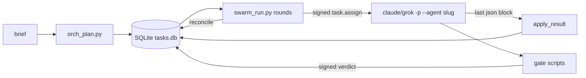

# Repository Guidelines

## Project Overview

AgentSwarm contains two things:

- **Design spec** for a 15-agent SDLC swarm, A01 ORCH through A15 DOC: `01-*.md` … `07-*.md` and `03-agents/`.
- **Runnable implementation:**
  - `swarm/` — Python runtime: signed envelopes, a SQLite task state machine, and gates.
  - `scripts/` — per-agent CLI tools, each with a Bun TypeScript twin.
  - Generated subagent definitions for Claude Code, Grok Build and Trae SOLO.

`scripts/swarm_run.py` drives headless `claude -p --agent <slug>` or `grok -p --agent <slug>` sessions against a target repo. This is not a library or a service.

## Architecture & Data Flow



**1. Plan** — `orch_plan.py`
- Turns a brief into a DAG, either from `PATTERNS` (feature = 13 tasks, hotfix = 8, dependency = 8) or from `--pattern custom --plan plan.json`.
- Writes rows to `$SWARM_DIR/tasks.db`, plus `plans/<corr>.json` and `latest_correlation`.

**2. Run** — `swarm_run.py` loops in rounds of `reconcile()` → `dispatchable()` → `execute_one()`.
- Each round runs a `ThreadPoolExecutor(--max-parallel)` with one SQLite connection per thread.
- For each task it writes a signed `task.assign` to `assignments/` and saves output to `results/<tid>.a<N>.md`.
- Claude runs with cwd set to this repo and `--add-dir <repo>`.
- Grok runs with `--cwd <repo> --yolo`.

**3. Result protocol**
- The agent's **last** ```json block is parsed: `{state: IN_REVIEW|BLOCKED|FAILED, outputs[], verdicts{target:{verdict,findings}}}`.
- `apply_result()` records artifacts and verdicts.

**4. Gates** — `qa_gate.py` (quality), `rev_gate.py` (review), `sec_gate.py` (security), `rel_plan.py` (release)
- Each calls `make_verdict`, which signs the verdict.
- Each writes `verdicts/<task>.<gate>.json` and calls `TaskStore.record_verdict`.

**5. Reconcile**
- If any required gate fails: CHANGES_REQUESTED, then a rework back to IN_PROGRESS. Gate tasks are re-created as `<gate-id>.r<N>`.
- The 3rd failure (`MAX_REWORK_LOOPS=2`) moves the task to ESCALATED and emits an `escalation.request` event.
- All required gates pass or waive (unexpired, issued after the last rework): APPROVED, then DONE.

**State machine** (`swarm/taskstore.py`: `TaskState`, `LEGAL_TRANSITIONS`)
- States: CREATED → VALIDATED → PLANNED → CLAIMED → IN_PROGRESS → IN_REVIEW → APPROVED → DONE, plus BLOCKED, FAILED, RETRY, CHANGES_REQUESTED, ESCALATED, CANCELLED.
- An illegal transition raises `SwarmError`.
- A move to APPROVED is refused (fail-closed) while `missing_gates()` is non-empty.
- A dependency counts as satisfied once it reaches IN_REVIEW, APPROVED or DONE.

**Gates by risk** (`GATES_BY_RISK`)
- low → review
- medium → review, quality
- high → review, quality, security, release
- `notes.gates` overrides the list; `[]` means no gates.
- Within one gate, the **latest** verdict wins (`latest_verdicts`). Across gates, the results are ANDed.
- A verdict expires after 86400 s; review verdicts after 172800 s.

**Signing** (`swarm/envelope.py`)
- Ed25519 when `SWARM_ED25519_KEY` (hex seed) is set and `cryptography` imports.
- Otherwise HMAC-SHA256 with `SWARM_SIGNING_KEY`, defaulting to `dev-insecure-key`. Every dev-key signing emits a `security.dev_key` event into the caller's resolved state dir.
- Signatures are prefixed `ed25519:` or `hmac:`.
- Envelope schema is `swarm.v1.<type>`.
- `missing_gates()` verifies each required verdict's signed envelope before APPROVED; malformed or forged rows read as `bad-sig`.
- A dev-key `hmac:` signature never verifies while `SWARM_ED25519_KEY` is set (even if unloadable) or `SWARM_REQUIRE_KEY=1`.
- `SWARM_REQUIRE_KEY=1` without a real key fails APPROVED closed (E-POLICY). Gate scripts exit 2 with an explicit key-configuration error under a missing or unloadable key.

**Hooks**
- `hooks/user_prompt_submit.py`
  - Fail-open: always exits 0.
  - Emits `{"additionalContext": …}` on **every** non-empty prompt that doesn't start with `/`. Prompts containing `/uplift`, `/think`, `explain only` or `/all-in-one:` are excluded.
  - Emits `{}` when `SWARM_CHILD=1`.
- `hooks/autonomous_run.py`
  - Started by an external plugin (`src/swarm/kickoff.ts`, not in this repo).
  - Runs plan and run, with a 120 s dedupe lock at `$SWARM_DIR/kickoffs/<sha16>.lock`.
  - Overwrites `$SWARM_DIR/autonomous.log`.

**Generation pipeline**
- `prompts/` + `agents.json` → `build_agents.py` → `.claude/agents/<slug>.md` and `.grok/agents/<slug>.md`
- `prompts/` + `agents.json` → `build_trae_agents.py` → `.trae/`: 15 XML prompts of at most 10,000 characters each, `registration.json`, `commands/swarm.md`, `README.md`
- `_write_skills.py` → `skills/<slug>/SKILL.md` and `skills/orchestrate/SKILL.md`

## Key Directories

| Path | Purpose |
|---|---|
| `swarm/` | Runtime toolkit: `envelope`, `taskstore`, `gates`, `errors`, `script_base`, `runlog`, `manifest` |
| `scripts/` | Per-agent tools (`<lane>_<verb>.py`), orchestration (`orch_plan`, `swarm_run`, `orch_status`) and generators |
| `scripts/ts/` | Bun twins. 14 pass through to Python via `passthrough.ts`. 5 are native **subsets**: `code_checks`, `fe_a11y_check`, `req_lint`, `sec_gate`, `ux_tokens` |
| `prompts/` | **Source of truth** for agent behaviour: XML-tagged system prompts |
| `03-agents/` | Original 7-section agent specs (Purpose, Stack, Communication, Decision logic, Errors, Metrics, Security) |
| `hooks/` | `user_prompt_submit.py` and `autonomous_run.py` |
| `.claude/agents/`, `.grok/agents/`, `.trae/`, `skills/` | **Generated.** Never hand-edit |
| `.swarm/` | Runtime state (own `.gitignore` of `*`, written on creation; the repo's `.gitignore` is never touched): `tasks.db`, `events.jsonl`, `plans/`, `assignments/`, `results/`, `verdicts/`, `kickoffs/`, `releases/`, `artifacts/`, `slo/`, `incidents/`, `patch_tasks/` |
| `docs/superpowers/specs/` | Spec for the prompt uplift, TS twins, skills and hooks |

## Development Commands

```bash
# tests
python3 -m pytest                                     # all Python tests (pyproject adds -q)
python3 -m pytest tests/test_swarm.py::test_plan_and_run_dry
bun test                                              # tests/ts/*.test.ts (== npm test; runs no Python tests)
ruff check .                                          # py312, E/F/W, E501 ignored; currently 3 pre-existing errors

# regenerate after editing prompts/ or agents.json (run BOTH)
python3 scripts/build_agents.py                       # .claude/agents + .grok/agents   (--check, --only A05,a06-frontend)
python3 scripts/build_trae_agents.py                  # .trae/                          (--check, --dry-run, --json)
python3 scripts/_write_skills.py                      # skills/ (overwrites everything; has no --check)
python3 scripts/build_agents.py --install-workspace /path/to/ws   # copy agents, skills and hooks into another workspace

# run the swarm in isolation (SWARM_DIR otherwise defaults to <git toplevel of --root or cwd>/.swarm)
export SWARM_DIR=/tmp/sw/.swarm
python3 scripts/orch_plan.py --brief-text "Add /health" --pattern feature --risk-class medium   # task ids T<4 hex of correlation>-*, e.g. T7f3a-be
python3 scripts/swarm_run.py --dry-run --json         # no model calls; canned results
SWARM_DRYRUN_FAIL=T7f3a-be:quality python3 scripts/swarm_run.py --dry-run   # inject a gate failure
python3 scripts/swarm_run.py --repo /path/to/codebase --max-parallel 3 --runtime auto|claude|grok
python3 scripts/orch_status.py [--history T7f3a-be] [--transition T7f3a-be STATE --reason ..] [--ingest result.json]   # --ingest takes a full task.result (task_id, state, outputs, metrics, summary_md)
```

## Code Conventions & Common Patterns

**Script skeleton.** Every agent tool follows this shape:

```python
sys.path.insert(0, str(ROOT))
def add_args(p): ...
def run(args, ctx) -> dict: return {"status": "ok"|"fail", "summary": ..., "findings": [...]}
sys.exit(AgentScript("A08", "qa_gate", run, description=__doc__, add_args=add_args).main())
```

**Shared CLI contract** (`swarm/script_base.py`; mirrored in `scripts/ts/script_base.ts`)
- Flags:
  - `--task-id`, defaulting to `$SWARM_TASK_ID`
  - `--correlation-id`, defaulting to `$SWARM_CORRELATION_ID`
  - `--root`, `--json`, `--dry-run`
- Exit codes: 0 ok, 1 `status=="fail"`, 2 `SwarmError` or any unhandled exception.
- Every run appends `script.<name>` to `events.jsonl`.
- Exception: `build_agents.py` uses plain argparse.

**Naming.** Scripts are named `<lane>_<verb>.py`, where lane is one of `orch_ req_ arch_ ux_ be_ fe_ data_ qa_ rev_ sec_ devops_ rel_ obs_ maint_ docs_`. `code_checks.py` is shared by BE and FE.
- `_`-prefixed scripts are internal one-shot generators. They are exempt from TS twins and dry-run tests.
- Every other `scripts/*.py` **must** have a `scripts/ts/<stem>.ts` twin.

**Errors.** Raise `SwarmError(ErrorCode.E_*, msg, **details)`.
- Codes: E-INPUT, E-TIMEOUT, E-DEP, E-CAPACITY, E-CONTRACT, E-POLICY, E-INTERNAL.
- Anything else is mapped by `errors.classify`:
  - `KeyError`, `ValueError`, `FileNotFoundError` → E-INPUT
  - `OSError` → E-DEP
  - everything else → E-INTERNAL

**Findings.** Build them with `gates.make_finding(id, severity, kind, summary, ...)`.
- Any finding of severity `major` or worse makes `derive_verdict` return fail.
- A `waive` verdict requires `waived_by`.

**Optional tools degrade.** If an external tool is missing, the script reports `skipped:tool-missing` instead of failing. This covers ruff, mypy, eslint, pip-audit, git, PyYAML and similar. `sec_gate.py --strict` turns a missing tool into a finding.

**State writes.**
- Only through `TaskStore.transition`, which logs to the `transitions` table.
- Agents report state through `orch_status.py --ingest`, which only accepts IN_PROGRESS, IN_REVIEW, FAILED or BLOCKED.

**Dry-run is not side-effect-free.**
- It still emits events.
- `swarm_run --dry-run` still mutates `tasks.db` and writes `assignments/` and `results/`.

**Headless child sessions** get `SWARM_CHILD=1 AIO_UPLIFT=0 AIO_SWARM=0`. `hooks/user_prompt_submit.py` must never spawn the runner: the literals `Popen` and `autonomous_run` are banned in that file, and a test enforces it.

**Output.** Progress goes to stderr and JSON to stdout, so `--json` output stays parseable.

## Important Files

- `agents.json` — manifest `swarm.manifest.v1`. Per-agent fields: `id, code, slug, capabilities, consumes, produces, tools, scripts, prompt, spec, autonomy_ceiling`.
  - Generated agents are always `model: inherit`; the `model` and `defaults` fields are ignored.
  - A01 is the only agent with the `Agent` tool.
- `swarm/taskstore.py` — states, transitions, rework and attempt limits, gates, DAG readiness.
- `swarm/envelope.py` — the envelope schema, `SIGNATURE_REQUIRED` types, sign and verify.
- `scripts/swarm_run.py` — runner. It also has `--once`, `--max-rounds`, `--task-timeout`, `--max-turns`, `--model`, `--allowed-tools` and `--permission-mode`.
- `scripts/orch_plan.py` — `PATTERNS`, the custom plan schema, and the `--prefix` for task IDs (default `T`).
- `pyproject.toml` — ruff and pytest config only; it has no `[project]` table.
- `package.json` — `bun test` and `build-agents`, which calls the Python generator.
- `tsconfig.json` — strict, noEmit, `bun-types`.
- `CLAUDE.md` — older summary. It is stale in places: it omits `.trae/`, `autonomous_run.py` and `--runtime`, and it lists `build_agents.py` as an A01 script, which `agents.json` does not.

## Runtime/Tooling Preferences

- **Python 3.12, stdlib-only.** New dependencies must be optional with a fallback:
  - `cryptography` is optional, for Ed25519.
  - PyYAML is optional, with a regex fallback, in `arch_contract_check`, `be_contract_conformance` and `devops_ci_check`.
- **Bun** runs the TS twins (`#!/usr/bin/env bun`). There are no npm dependencies, no lockfile and no `node_modules`.
- **Python is canonical.** Put logic in the Python script; TS twins pass through, and the TS generators call the Python ones.
- **`claude` must be on PATH** for real runs, even with `--runtime grok`: `swarm_run.py` calls `claude auth status`.
- **State dir resolution (`swarm/paths.py`).** Resolved per call, never at import: env `SWARM_DIR` (made absolute) → `<git toplevel of --root/--repo or cwd>/.swarm` → `<dir>/.swarm`. `swarm_run.py` and `hooks/autonomous_run.py` pass the absolute path to children. Creating the dir writes `.swarm/.gitignore` = `*` (never overwritten). Tests still set `SWARM_DIR` explicitly.
- **Other env vars:** `SWARM_AGENTS_FILE`, `SWARM_RUNTIME`, `SWARM_DRYRUN_FAIL`, `SWARM_CHILD`, `SWARM_ED25519_KEY`, `SWARM_SIGNING_KEY`.
- **No git repo of its own.** This directory has no `.git`; it is untracked under `/root/src/repos`.
- **Host-specific absolute paths.** `.mcp.json`, `skills/orchestrate/SKILL.md` and `.grok/hooks/agent-swarm.json` hard-code `/root/src/repos/agent-swarm`.

## Testing & QA

**Frameworks**
- pytest runs 41 tests in `tests/`. There is no conftest, CI or coverage config.
- `bun:test` covers `tests/ts/script_base.test.ts`.

**Isolation**
- Tests run scripts as subprocesses (`[sys.executable, ...]`, `cwd=ROOT`).
- They set `SWARM_DIR` to `tmp_path`.
- The `swarm_dir` fixture in `tests/conftest.py` purges the cached `swarm*` modules (harmless; resolution is lazy).

**Invariants the tests pin** — keep these true when editing:
- **Prompt tags.** Each `prompts/A*.md` has `<agent id="Axx"` and these 20 tag pairs: role, inputs, outputs, output_format, tools, decision_logic, autonomy, error_handling, metrics, security, constraints, system_role, scope, out_of_scope, workflow, acceptance_criteria, states, graph_of_thought, graceful_degradation, security_and_validation. It must also contain `<script path=`, `python3 scripts/` and `scripts/ts/`, and end with `</agent>`.
- **Generated files match their generators.** `build_agents.py --check` and `build_trae_agents.py --check` must pass. Each Trae prompt must be at most 10k characters; A01 is already near the limit, and an oversized prompt raises instead of being truncated.
- **Hard-coded counts.** Exactly 15 agents. DAG sizes feature=13, hotfix=8, dependency=8. The Trae bundle writes 18 files. Adding an agent or changing a pattern means updating these tests.
- **Script contract.** Every non-`_` script supports `--dry-run --json` and exits 0 or 1 with `status`. Every one has a TS twin whose output includes `agent` and `script`.
- **Skills.** Each has `name: <slug>`, `disable-model-invocation: false`, and `## When to Use` / `## Procedure` headings.
- **Generated agent frontmatter.** `.claude/agents` has `model: inherit`. `.grok/agents` has `prompt_mode: full`, `agents_md: true` and `permission_mode: default`.

**Gotchas**
- **Plan re-runs.** Re-running `orch_plan.py` with the same `--prefix` in the same `SWARM_DIR` fails with exit 2 (UNIQUE constraint). Use a fresh `SWARM_DIR` or a new `--prefix`.
- **Tests without bun.** `test_ts_scripts.py` is skipped when bun is missing. `test_uplift_harness.py` passes silently without it.
- **Smoke-check after changes:**
  - Script changes: `--dry-run --json` in a temp `SWARM_DIR`.
  - Prompt, manifest or generator changes: both `--check` generators, then `python3 -m pytest`.
