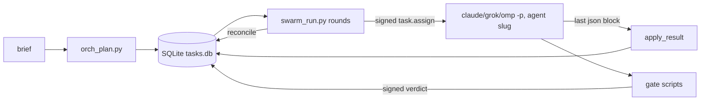

# Repository Guidelines

## Project Overview

AgentSwarm contains two things:

- **Design spec** for a 15-agent SDLC swarm, A01 ORCH through A15 DOC: `01-*.md` … `07-*.md` and `03-agents/`.
- **Runnable implementation:**
  - `swarm/` — Python runtime: signed envelopes, a SQLite task state machine, and gates.
  - `scripts/` — per-agent CLI tools, each with a Bun TypeScript twin.
  - Generated subagent definitions for Claude Code, Grok Build, Trae SOLO and omp.

`scripts/swarm_run.py` drives headless `claude -p --agent <slug>`, `grok -p --agent <slug>` or `omp -p` sessions against a target repo. This is not a library or a service.

## Architecture & Data Flow



**1. Plan** — `orch_plan.py`
- Turns a brief into a DAG, either from `PATTERNS` (feature = 13 tasks, hotfix = 8, dependency = 8) or from `--pattern custom --plan plan.json`.
- Writes rows to `$SWARM_DIR/tasks.db`, plus `plans/<corr>.json` and `latest_correlation`.

**2. Run** — `swarm_run.py` loops in rounds of `reconcile()` → `dispatchable()` → `execute_one()`.
- Each round runs a `ThreadPoolExecutor(--max-parallel)` with one SQLite connection per thread.
- For each task it writes a signed `task.assign` to `assignments/` and saves output to `results/<tid>.a<N>.md`.
- Claude runs with cwd set to this repo and `--add-dir <repo>`.
- Grok runs with `--cwd <repo> --yolo`.
- omp runs `omp -p --mode json --no-session --no-title --no-extensions -e <ROOT>/omp --cwd <repo> --approval-mode yolo --tools <frontmatter tools>,yield --append-system-prompt $SWARM_DIR/agents/<slug>.md --max-time <n>s [--model M]`, prompt on stdin. `<n>` is `--task-timeout` minus a margin of `min(60, max(5, task_timeout // 10))` s, never below 1 s, so omp aborts before the runner's timeout. `-e` loads the package while `--no-extensions` skips every other extension; the generated agent body is appended from `$SWARM_DIR/agents/<slug>.md`. The result is the `yield` payload of the terminal `agent_end` (else the last json block of the assistant text), appended as the last json block, so `swarm/results.py` parses it unchanged. A `yield` that did not succeed (e.g. status `aborted`) sets `meta.is_error` and fails the task with E-CONTRACT (`agent yielded an error: …`), even when the assistant text carries a json block. If omp prints `Failed to load extension …` on stderr (the `-e` package, and with it the guard, did not load; omp still exits 0), the task fails E-DEP (`omp ran the session without the swarm guard: …`): its result is not applied and no gate is recorded.
- `--dry-run` prints each task's exact runtime invocation to stderr as a replayable line: `env -u SWARM_SIGNING_KEY -u SWARM_ED25519_KEY -u SWARM_REQUIRE_KEY K=V… <argv> < $SWARM_DIR/assignments/<tid>.a<N>.md`, where `K=V` are `SWARM_DIR`, `SWARM_CHILD`, `SWARM_AGENT_SESSION`, `SWARM_AGENT`, `AIO_UPLIFT` and `AIO_SWARM`. The claude session's process cwd (this repo) is not part of the line.

**3. Result protocol**
- The agent's **last** ```json block is parsed: `{state: IN_REVIEW|BLOCKED|FAILED, outputs[], verdicts{target:{verdict,findings}}}`.
- `apply_result()` records artifacts and verdicts.

**4. Gates** — `qa_gate.py` (quality), `rev_gate.py` (review), `sec_gate.py` (security), `rel_plan.py` (release)
- Each calls `make_verdict`, which signs the verdict.
- Each writes `verdicts/<task>.<gate>.json` and calls `TaskStore.record_verdict`.
- `rev_greptile_ingest.py` (A09, advisory) turns the open Greptile threads of a PR (`--threads FILE` export, or `--pr OWNER/REPO#N` through one read-only `gh api graphql` query) into the `{target: [finding]}` file that `rev_gate.py --per-target-findings` takes. P0 blocker, P1 major, P2 minor, P3 and lower info, no badge major (fail closed); resolved, outdated and non-Greptile threads are dropped and counted; `--map FILE` attributes findings to targets by path glob and an unmatched finding goes to every target. It never writes to GitHub, the Task Store or a verdict.

**5. Reconcile**
- If any required gate fails: CHANGES_REQUESTED, then a rework back to IN_PROGRESS. Each gate lineage is re-created once per rework as `<base>.r<N>` (base = the gate id without trailing `.rN`; N = the latest member's rerun sequence + 1, counted per lineage, not the target's rework count), from its latest member only, and added to the dependencies of anything that depended on the lineage. A release-gate rerun also waits for the other gate reruns of the same rework.
- The 3rd failure (`MAX_REWORK_LOOPS=2`) moves the task to ESCALATED and emits an `escalation.request` event.
- All required gates pass or waive (unexpired, issued after the last rework): APPROVED, then DONE.

**State machine** (`swarm/taskstore.py`: `TaskState`, `LEGAL_TRANSITIONS`)
- States: CREATED → VALIDATED → PLANNED → CLAIMED → IN_PROGRESS → IN_REVIEW → APPROVED → DONE, plus BLOCKED, FAILED, RETRY, CHANGES_REQUESTED, ESCALATED, CANCELLED.
- An illegal transition raises `SwarmError`.
- A move to APPROVED is refused (fail-closed) while `missing_gates()` is non-empty.
- A dependency counts as satisfied once it reaches IN_REVIEW, APPROVED or DONE.

**Gates by risk** (`GATES_BY_RISK`)
- low → review
- medium → review, quality
- high → review, quality, security, release
- `notes.gates` overrides the list; `[]` means no gates.
- Within one gate, the **latest** verdict wins (`latest_verdicts`). Across gates, the results are ANDed.
- A verdict expires after 86400 s; review verdicts after 172800 s.
- Gate scripts record verdict rows only for a leased (IN_PROGRESS) gate task, one per `notes.gate_for` target, each signed with the target's correlation. A `--correlation-id` of another plan exits 2 E-POLICY with no rows.
- `--dry-run` verdicts are signed `dry_run: true`. They are recorded only for a gate task that `swarm_run --dry-run` dispatched (`notes.dry_run`, written by A01 only) and count only on targets it dispatched the same way.

**Signing** (`swarm/envelope.py`)
- Ed25519 when `SWARM_ED25519_KEY` (hex seed) is set and `cryptography` imports.
- Otherwise HMAC-SHA256 with `SWARM_SIGNING_KEY`. There is no implicit dev key. The public dev key is used only when `SWARM_ALLOW_INSECURE_DEV_KEY=1`, and not while `SWARM_ED25519_KEY` is set or `SWARM_REQUIRE_KEY=1`. The unset or empty `SWARM_SIGNING_KEY` opt-in path emits a `security.dev_key` event into the caller's resolved state dir, except a gate-script preview inside an agent session (`SWARM_AGENT_SESSION=1`), which records nothing and emits only `gate.verdict.unrecorded`.
- Without a real key and without that opt-in, `sign_envelope` refuses (`E-POLICY`), gate scripts record no verdict rows and emit `gate.verdict.unrecorded` (the envelope file is advisory), a dev-key `hmac:` signature does not verify, and the transition to APPROVED fails closed (`fail-closed: no signing key configured`). Unsetting the opt-in makes a dev-key signature stop verifying. `swarm_run` calls `preflight_signing()` before it leases or claims a task, including `--dry-run`, and raises that same refusal so a keyless run leaves every task unattempted. A keyless quality or security gate whose own checks pass still fails when a per-target finding is blocking: the advisory file verdict is fail and the unsigned per-target envelopes are returned without writing verdict rows. Local keyless runs need the opt-in or a real key. Tests pass a throwaway `SWARM_SIGNING_KEY` (`secrets.token_hex`); the dev-key opt-in is only for tests of that path.
- Signatures are prefixed `ed25519:` or `hmac:`.
- Envelope schema is `swarm.v1.<type>`.
- `missing_gates()` verifies each required verdict's signed envelope before APPROVED. `missing_gate_reasons` (`orch_status --history`) names why a gate is missing: `absent`, `unsigned`, `bad-sig` (malformed or forged), `mismatch` (row, task or correlation disagree), `stale` (signed before the last rework, even if re-inserted), `dry-run`, `fail`, `expired`.
- A dev-key `hmac:` signature never verifies while `SWARM_ED25519_KEY` is set (even if unloadable) or `SWARM_REQUIRE_KEY=1`, even when `SWARM_ALLOW_INSECURE_DEV_KEY=1`.
- `SWARM_REQUIRE_KEY=1` without a real key fails APPROVED closed (E-POLICY). Gate scripts exit 2 with an explicit key-configuration error under a missing or unloadable key. The keyless fail-closed path above does not require `SWARM_REQUIRE_KEY=1`.

**Hooks**
- `hooks/user_prompt_submit.py` (Claude Code UserPromptSubmit)
  - Fail-open: always exits 0.
  - Emits `{"additionalContext": …}` only on **SDLC-shaped** prompts (build, implement, add, create, fix, refactor, migrate, deploy, release, ship, write tests, set up, integrate, scaffold, upgrade). Silent for questions (interrogative start, trailing `?`, explain/describe), trivial edits (typo, leading rename), prompts starting with `/` or `<system-reminder`, and prompts containing `/uplift`, `/think`, `explain only`, `/all-in-one:` or `[agent-swarm:dispatch]`.
  - `tests/fixtures/classifier_prompts.json` (`{positive, negative}`) is the shared contract: `tests/test_hook.py` and `omp/test/hooks.test.ts` both read it, so the Python and TS classifiers cannot drift.
  - Emits `{}` when `SWARM_CHILD=1`.
- **omp extension hooks** (`omp/src/index.ts` registers them; the same classifier and identity rules as above)
  - Identity: the session's `session_init.agent`, else env `SWARM_AGENT` (headless `-p` only; `omp/src/context.ts` `callingAgent`). A *swarm session* is one of the 15 slugs, or a top-level session with `SWARM_AGENT` or `SWARM_TASK_ID` set.
  - HOOK-01 `before_agent_start` (`omp/src/hooks.ts`): appends a `## AgentSwarm` system-prompt part pointing at `/swarm <brief>` and `task` with `agent: "a01-orchestrator"`. Silent in subagents (any `session_init`), under `SWARM_CHILD=1` or `SWARM_AGENT`, when the part is already present, and on every non-SDLC prompt above; a classifier throw leaves the prompt untouched; it never spawns. An Ultrathink/Prompt-Uplift XML prompt (root `BUILD_PROMPT`, `FIX_PROMPT`, `RESEARCH_PROMPT`, `CHANGE_PROMPT`, `UPLIFTED_PROMPT`, `uplifted` or `ultrathink`) is classified by its unescaped `<ORIGINAL>` text, else as the whole prompt (`classifiedText`), so HOOK-01 agrees with the plugin's headless kickoff; `hooks/user_prompt_submit.py` has no such extraction.
  - Runtime root (`before_agent_start`, `runtimeContext` in `omp/src/hooks.ts`): a session whose calling agent is one of the 15 slugs (`session_init.agent`, else `SWARM_AGENT` in `-p`) gets a `## AgentSwarm runtime` system-prompt part with `Runtime root: <abs agent-swarm root>` (`swarmRoot()`); the omp preambles run `python3 <runtime root>/scripts/<script>.py … --root <repo> --json` from it (the repo root when the part is absent). Skipped when already present; fail-open. The exported `RUNTIME_HEADING` and `RUNTIME_ROOT_LABEL` are the contract `omp/test/runtime_contract.test.ts` pins.
  - HOOK-02 autonomy ceiling (`tool_call`, swarm sessions only): the ordered rule table `RULES` in `omp/src/guard.ts` matches normalized `bash` commands (leading `env X=…`/`X="a b"`/`sudo -u …`/`command`/wrappers such as `time`, `nohup`, `timeout 60`, `nice`, `stdbuf`, `xargs`, `eval` stripped, each wrapper word also when given by path, e.g. `/usr/bin/env`, `/usr/bin/sudo`, `../tools/timeout`; split on `;`, `&&`, `||`, `|`, newline, `( … )`, `{ …; }` and `$(…)` outside quotes, with backslash-newline joined and heredoc bodies and `#` comments skipped; a literal `sh -c "…"`/`eval "…"` argument is normalized too; quoting, escapes and the other spellings in the D-08 bullet below are read as bash reads them). A hit blocks with `BLOCKED needs: human-approval (<capability>: <rule id>)`. Universal `destructive` rows: `git-force-push`, `git-reset-hard`, `git-clean-force`, `git-branch-force-delete`, `git-discard-repo`, `rm-rf-protected`, `chmod-777-recursive`, `shell-stdin` (a shell, or `source`/`.`, reading its script from stdin — a pipe as in `curl … | sh` or `echo … | bash`, a heredoc, a here-string, a `<` redirect, `-s`, a `-`/`/dev/stdin` script — blocks whatever the script, since it can be built at run time; `bash script.sh`, `bash -c '…'` and non-shells such as `ssh`/`mosh` pass: `SHELL_WORD` in `guard.ts` names the shells). A07 `destructive_ddl`: `ddl-drop-truncate`, `prisma-migrate-reset`, `db-push-accept-data-loss`. A11 `prod_infra`: `terraform-apply-destroy`, `pulumi-up-destroy`, `helm-release-change`, `kubectl-prod-change`, `cloud-destructive`. A12 `prod_high_risk`: `vercel-prod`, `fly-deploy`, `gh-release-create`, `package-publish`, `docker-push`, `git-push-protected` (also `git push --all`/`--mirror`). Only `--dry-run`, `--dry-run=client|server|true` exempt kubectl/helm (`=none`/`=false` apply for real), and every exemption counts only in its own syntactic slot: `--dry-run` as the tool's own flag (not a flag value such as `--set --dry-run`, not after `--` — `kubectl exec pod -- cmd --dry-run=client` is live), `helm plugin` only as the subcommand, `rollout status|history`/`apply view-last-applied` only right after the verb, `publish --dry-run` only before `--`, a compressor's `-c` only as its own flag (not `-S -c`, not after `--`). Prod markers are fixed in `PROD_MARKERS` (`prod`, `production`, `--prod`, `main`, `master`, release tags), never configured in `agents.json`; `kubectl apply -f k.yaml` passes, `-n production` blocks. The rows read the forms the tools accept: flag values attached or `=`-joined (`-nprod`, `-n=prod`, `--namespace prod`, `--context=prod-cluster`, a `KUBECONFIG=` prefix), short-flag clusters (`git push -fu`, `git clean -xfd`, `rm -Rf`, `rm -r -f`), global options before the verb (`git -C x`/`-c k=v`, `helm --kube-context`, `terraform -chdir=`, `docker --context`, `gh -R`, `npm --registry`, `aws --profile`), tool wrappers (`npx vercel@latest`, `npx prisma`) and synonyms: kubectl/oc `create|apply|replace|patch|edit|delete|set|label|annotate|expose|autoscale|scale|drain|cordon|uncordon|taint|run|cp|exec|attach|debug|certificate approve|deny|rollout` (not `rollout status|history`, `apply view-last-applied`); `git push --mirror`/`+refspec` (force), `--all|--branches|--mirror`, `:main`, `--delete main` and `gh pr merge` (protected push); `git branch -M|-C|-f`, `git checkout|switch -f`, `git stash drop|clear`; `git -c clean.requireForce=false clean`; `chmod -R` of any world-writable mode (`0777`, `666`, `o+w`, `a+rwx`); `dropdb`, `redis-cli FLUSHALL`, Mongo `dropDatabase`; `supabase db reset`, `rails db:drop|reset`, `manage.py flush`; `prisma db push --force-reset`, `drizzle-kit push --force`; `terraform apply -destroy|import|taint|state rm|workspace delete` and terragrunt; `pulumi update|refresh|import|stack rm|state delete`; `helm upgrade --install|uninstall|del|rollback`; `aws … rm|mv|deploy|s3 sync --delete`, `az`, `gsutil`, `doctl` deletes; `vercel|vc --prod|--target production|promote|rollback`; `fly deploy|destroy|scale|secrets set`; `gh release create|edit|delete|upload` and `gh api` writes to releases; `cargo|poetry|uv|twine|gem|dotnet nuget|mvn|gradle` publishing (`--dry-run` passes); `buildx --push`, `skopeo|crane copy`.
  - HOOK-03 swarm state (every session, the identity-less main session included): `swarm_transition` and `swarm_ingest` from anyone but `a01-orchestrator` block with `BLOCKED needs: human-approval (swarm-state)`. The shell twin `orch-state-shell` blocks non-A01 swarm agents *running* `orch_plan.py|ts` or `orch_status.py|ts --ingest|--transition`, and `sqlite3` opened on a path under `.swarm/`; `gate-script-shell` (`BLOCKED needs: human-approval (gate: gate-script-shell)`) blocks a run of `qa|quality|rev|review|sec|security|release_gate.py|ts` / `rel_plan` by any swarm agent, the gate's owner included: gates are recorded only through `swarm_gate`, which pins the gate script to the session's workspace. Both rules match the executed file (`executedScript` in `omp/src/guard.ts`): argv[0], the first word after `python`/`python3`/`python3.N`/`pypy`/`bun`/`bunx`/`node`/`deno`/`tsx`/`ts-node`/`npx`/`uv`/`pipx` and their `run`/flags, or the module after `-m`; its basename (or the module's last dotted name) is compared in any directory, so `cd scripts && python3 orch_plan.py`, `python3 other/orch_plan.py` and `python3 -m scripts.rev_gate` count. `cat`, `grep`, `pytest`, `ruff` and `python3 -m pytest` on those files pass.
  - HOOK-04 depth cap: `a01-orchestrator` without the `task` tool (not in plan mode, not a restricted child) can only `yield` `{state: "BLOCKED", needs: "depth"}`; every other call is blocked with a reason starting `BLOCKED needs: depth`. A guard error blocks inside a swarm session (`BLOCKED needs: human-approval (guard error: …)`) and is ignored outside one.
  - D-08 hardening (swarm sessions): `eval` is blocked outright (`eval-in-swarm`); a `write` whose `path` or `file_path` is `xd://run_code` or `xd://debug` (any case, optional query or subpath) blocks with the same class (`eval: xd-device`); every MCP tool call (`mcp__*`, any case) and every `write` whose `path` or `file_path` is an `xd://mcp__…` device block with `BLOCKED needs: human-approval (mcp: <tool name | device path>)`, since MCP tools act with the operator's credentials and `--tools` does not keep them out of a session; other `xd://` devices are unaffected; `write`/`edit` into `.swarm/`, `.omp/` (any case), `~/.omp` or the agent-swarm runtime root (env `SWARM_ROOT` and the extension package's repo, spelled without fs: the live guard in `omp/`, the gate scripts in `scripts/` the runner later runs with keys, `swarm/`, `hooks/`, `agents.json`) block (`protected-path-write`) in every edit mode — `path`/`file_path`, hashline `[path#TAG]` headers and `MV` rows, apply_patch `*** Add|Update|Delete File:` / `*** Move to:` directives, and the `paths` of a `write` whose `path` or `file_path` is `xd://ast_edit` (any case, optional query or subpath); the runtime root is exempt when the session's cwd is inside it (self-development). The bash rows block the same paths as shell targets: redirections (`>`, `>>`, `>|`, `&>`, `<>`, `>&file`, before or among the words; `2>&1`-style descriptor copies and `/dev/null`-style sinks and open descriptors (`/dev/fd/N`, `/proc/self|thread-self|$$/fd/N`) aside), `tee`, `cp`/`mv`/`install` destinations, the output-file options of the command that has them (`curl -o`, `sort -o`, `gcc -o`, `wget -O`/`-P`, `go -coverprofile`, `pg_dump -f`, …; `grep -o` writes nothing) and the file a `curl -O`/`wget` download names after its URL (`protected-path-shell`); in-place mutation through `rmdir`/`unlink`/`link`/`ln` (every operand: a link makes its source writable elsewhere)/`shred`/`truncate`/`fallocate`/`sqlite3`/`chmod`/`chown`/`chgrp`/`chattr`/`setfacl`/`touch`/`mkdir`/`mkfifo`/`mknod`/`mktemp`/`sponge`/`sudoedit` (and `sudo -e`)/`rename`/`patch`/`ed`/`ex`/`vi(m)`/`emacs`, compressors (unless writing to stdout), `sed -i`, `perl|ruby -i`, `awk -i inplace`, `yq -i`, `dd of=`, `tar -C` and the archive `tar -c|-r|-u` writes, `unzip -d`, `zip`, `split`, `script` logs, `install -d`, the `rsync` destination, the sources `mv`, `cp -l|-s` and `rsync --remove-source-files` give away, `find -delete`/`-fprint`/`-fls`, and the paths `git checkout|restore|rm|mv|clone|init|worktree` and `git config -f` touch (under `git -C`/`--work-tree`) (`protected-path-mutate`); any `rm` of a protected path or `rm -r` of `.git` (`rm-rf-protected`); and turning on dotglob — `shopt -s … dotglob`, `setopt globdots`/`GLOB_DOTS`, `unsetopt noglobdots`, `set -o globdots`, a shell started with `-O dotglob`/`-Odotglob`/`-o globdots`, any of these naming an expansion, a `GLOBIGNORE=`/`BASHOPTS=` assignment word (also after `export`/`declare`/`env`), or `GLOBIGNORE`/`BASHOPTS` in the bash tool's `env` (`protected_path: glob-dotfiles`); a mention of the name as data (`grep -R dotglob .`, a commit message) is none. Normalization reads a command as bash would: plain quoted and escaped words are unquoted (`"rm"`, `\rm`, `r""m`, `'-i'`, ANSI-C `$'…'` with its escapes), `${IFS}` is a blank, unquoted brace lists expand (`{touch,.swarm/x}`), a `$(…)`/backtick body is a command of its own that runs as a subshell of the command holding it (in that command's directory; a `cd` inside it moves nothing else), leading `env`/`sudo`/`doas`/`pkexec`/`command`/assignments/redirections, the wrappers (`time`, `nohup`, `exec [-a]`, `builtin`, `eval`, `nice`, `ionice`, `stdbuf`, `timeout`, `xargs`, `parallel`, `setsid`, `fakeroot`, `chrt`, `taskset`, `unshare`, `chroot`, `flock FILE`, `watch`, `busybox`/`toybox` before an applet name) and the keywords `if`/`then`/`else`/`elif`/`do`/`while`/`until`/`!`/`coproc` are stripped, it splits on a lone `&` and reads `|`/`&` after an unquoted, unescaped `>` as part of a redirection (`>|`, `2>&1`), and an extglob group stays inside its word. Commands one command runs for another are checked too: a shell's `-c` line (a shell by basename, `SHELL_WORD`: `sh`, `bash`, `zsh`, `dash`, `fish` …, not `ssh`/`mosh`, with its options: `-c LINE`, `-lc LINE`, `-cl LINE`, `-c -- LINE`, and, failing closed, text attached to the cluster as in `bash -c'LINE'`; the words after it are `$0`, `$1` …), the `-c`/`-cLINE`/`--command=` value of `su|runuser|script` and `flock FILE`, an `env -S` string with the remaining words appended, every `alias NAME=` value, the `trap` action, and the command line `eval`, `watch`, `parallel` and `sudo -s|-i` build by joining all their arguments (`eval "git push" --force`), and the commands of `find -exec|-execdir|-ok|-okdir` (`-execdir` in an unknown directory); a script fed to a shell's stdin is not unwrapped but blocked outright (HOOK-02 `shell-stdin`). A shell target the text cannot settle fails closed as protected: a variable or cut substitution (`"$f"`, `$(…)/x`, `$SWARM_DIR/x`; only a leading `$HOME`, `$TMPDIR` or `$PWD` is expanded, and HOME/TMPDIR/CDPATH not when the command itself assigns them: an assignment word, `export`/`declare`/`local`, `unset`, `read`, `for`, `printf -v`, `getopts` or a nameref — `echo HOME` is no assignment), `~user`/`~+`/`~-`, `/proc/*/cwd|root|fd`, an operand `xargs`/`parallel` append or put in for `-I R`/`{}` (and find's `{}`), a glob, extglob or brace list that may name `.swarm`, `.omp`, a guarded runtime root or `..` (bash's dot rule applies: a leading `*`/`?` names no dotfile, hence the glob-dotfiles row), and every operand of a command named by an expansion or a glob (`$RM`, `$(which rm)`, `/bin/r?`). So in a swarm session `> "$VAR"` targets, `rm -rf $(mktemp -d)`, `for f in *; do rm "$f"; done`, `find … -delete` and `find … -exec rm {}` all need approval. Relative shell targets resolve in every directory the command may be in at that point (`walk` in `guard.ts`, bash scoping), starting from the bash tool's `cwd` (an internal-URL `cwd` is unknown; its `env` `HOME` and `CDPATH` count): `cd`/`pushd`/`popd` move the shell for what follows, a `( … )` subshell, each pipeline member and a `&` background list restore it, `{ …; }` does not, and `env -C`/`sudo -D`/`unshare -w` move only their own command and its payload (`chroot`, `unshare -R` make it unknown). A move that may fail or may not run (any target but the directory itself or an ancestor; after `&&`/`||`; inside `if`/`case`/a loop; behind a wrapper) keeps the old directory as a candidate too, so `cd .swarm && touch tasks.db`, `true || cd .swarm; touch tasks.db` and `cd .swarm; cd /nonexistent; touch tasks.db` block while `cd .swarm && cat tasks.db`, `cd .swarm; cd ..; touch a.txt`, `pushd .omp; popd; echo x > out.txt` and `(cd .swarm && cat x); echo y > out.txt` pass. An unresolvable directory (`cd -`, `cd "$DIR"`, `cd "$(pwd)/x"`, `popd` of an unknown stack or inside a loop, more than 16 candidate states) fails closed: every relative write target there counts as protected.
  - `/swarm <brief> [--pattern=feature|hotfix|dependency] [--risk=low|medium|high]` (`omp/src/commands.ts`): plans the brief through the same bridge and argv as `swarm_plan` (defaults feature / medium) under a deterministic `--correlation-id` (a uuid5 of pattern, risk class and the trimmed brief, fixed namespace in `commands.ts`), then sends a `[agent-swarm:dispatch]` prompt that makes the session call `task` once with `a01-orchestrator` and a `task.assign` payload `{correlation_id, capability: "plan.execute", ready_tasks}` (the plan's tasks with an empty `depends_on`), then holds the session on `ctx.isIdle()` until the dispatch turn ends (a 10 s start timeout — "dispatch did not start", level error — and a hold cap: `SWARM_DISPATCH_HOLD_MS` when set, else 30 min with a UI and unbounded in `-p`/rpc, where returning would end the run mid-orchestration; a cap expiry is reported at level warning as "plan … dispatched … still running"), and finally drains with `waitForIdle` (which resolves during a prompt's pre-loop window, so it is not the turn signal). An empty brief or bad flag shows usage; plan mode refuses with E-POLICY; an `E-CONTRACT` conflict shows the `orch_plan` hint. Without a UI every warning/error is also written to stderr as `[/swarm] …` (never stdout); the success line is UI-only, the plan summary travels in the dispatch prompt. Nothing is dispatched without a successful plan. Re-running the same brief, pattern and risk class hits the same correlation and derived prefix, so `orch_plan` returns the existing plan (`reused: true`, no writes); any other brief, pattern or risk class gets its own correlation and a fresh plan (`orch_plan`'s 4→6 hex prefix fallback still covers a prefix already used by another correlation).
  - The generated `swarm-orchestrate` skill makes A01 ingest a child ending with `SUBAGENT_WARNING_MISSING_YIELD` as FAILED or BLOCKED, never IN_REVIEW.
  - Residuals (accepted, not closable in-process): the bash rows read the command text, so what never reaches them as text evades them — interpreters and scripts (`python3 -c`, `node -e`, `perl -e` without `-i`, script files, `make`, package-manager scripts, git hooks and git aliases such as `git -c alias.x='!…' x`), a shell line held in a variable or produced at run time (`bash -c "$VAR"`, `eval "$CMD"`, `source <(…)`), copies or renames of the gate/orch scripts run under another name; programs that write paths taken from their input, config or content (`tar -x`/`unzip` without a directory, `patch`/`git apply`/`git am` from a diff, formatters and linters that rewrite files, compilers without `-o`, and git operations that rewrite tracked files such as `.omp/config.yml` from repository content: branch checkout/switch, merge, rebase, pull, `stash pop`, cherry-pick, and `git push` of the current branch without a refspec); symlinks, hard links and bind mounts that already point into a protected path (creating a link to or in one blocks); state an earlier call left in omp's persistent shell other than its working directory (aliases, functions, variables, `CDPATH`, shell options); runners the guard does not strip (`strace`, `gdb`, `valgrind`, `ssh`, `docker exec`, `systemd-run`, `runuser -u … --`, …) and the lock file `flock` creates; raw `eval` code bypasses `tool_call` (hence the outright block; no agent is granted `eval`); AR-04 key custody stays open (in-process subagents share the operator's uid, env and `.swarm/` keys — the path rules are defence in depth only; a per-agent uid or container is Phase 6/7); L3 capabilities that are not shell-visible (scope_change, breaking_contract, brand_change, public_docs, contract/design deviation, major_bump, waive, accept_risk) remain prompt- and gate-enforced only. A session working inside the agent-swarm checkout itself (cwd equal to or under the runtime root) may edit its own guard and gate scripts: self-hosted runs are exempt from the runtime-root rule, and their gate-script changes are part of the reviewed diff.
  - Self-containment (D-09): `omp/src/paths.ts` holds `gitToplevel`/`swarmDir` (no I/O at import), `bridge.ts` and `tools.ts` import it, and `scripts/ts/script_base.ts` re-exports it, so no `omp/src` file imports outside `omp/`. The package still runs the Python scripts of an agent-swarm checkout: a relocated `omp/` needs `SWARM_ROOT` (else `E-DEP`).
- `hooks/autonomous_run.py`
  - Started by an external plugin (`src/swarm/kickoff.ts`, not in this repo). The all-in-one plugin (`/root/src/repos/plugin`) detaches `autonomous_run.py --runtime omp` only for D-09 classifier-positive prompts; it skips with reason `in-session` when the agent-swarm `/swarm` command is loaded (an extension-sourced command; a prompt or skill command named `swarm` does not count), with `swarm-child` under `SWARM_CHILD=1` or a non-empty `SWARM_AGENT`, and with `missing-runtime` when the configured runtime binary (plus `bun` for a bun-shebang omp) is not on `PATH`. That check is skipped for runtime `auto` and for dry-run, since `swarm_run --dry-run` skips its E-DEP preflight.
  - Runs plan and run, with a 120 s dedupe lock at `$SWARM_DIR/kickoffs/<sha16>.lock`. `--runtime auto|claude|grok|omp` is forwarded verbatim to `swarm_run.py`.
  - Overwrites `$SWARM_DIR/autonomous.log`.

- New after-orchestrate hook (n3/n8): `hooks/on_a01_complete.py` (thin) + `swarm/hook_trigger.py` + `swarm/signal_detector.py`. Fires (opt-in AIO_SWARM_AFTER_ORCH=1) on a01-orchestrator IN_REVIEW or uplift end. ID=sha(session+fp+corr), dedup via state_store. Stub side-effect now; later: spawn gsd-autonomous or parallel swarm. Thin shims in user_prompt_submit + autonomous_run delegate classify to detector. Separate .swarm/ state; .claude/swarm-state.json obs projection.
- Adopted n6 defaults: a01-complete signal, sequential default (until safety), opt-in, separate state.
**Generation pipeline**
- `prompts/` + `agents.json` → `build_agents.py` → `.claude/agents/<slug>.md`, `.grok/agents/<slug>.md`, `.cursor/agents/<slug>.md`, `omp/agents/<slug>.md` and `omp/skills/<slug>/SKILL.md`
  - `build_agents.py` also writes and `--check`s `omp/skills/swarm-orchestrate/SKILL.md` (rendered by `_write_skills.swarm_orchestrate_skill()`).
  - `omp/agents/` and `omp/skills/` are generated; `omp/package.json`, `omp/src/` and `omp/test/` are hand-written (see **omp extension package** below).
  - The omp preamble of the four gate agents (A08, A09, A10, A12; `GATES` in `build_agents.py`) mandates `swarm_gate` for recording their gate and forbids running the gate script through bash; for the review, quality and security gates it requires each failing target in `per_target_findings` with at least one `major` finding. Their `prompts/` bodies, and so the claude and grok renders, still run the scripts, where the headless runner records.
  - omp `tools:` lists are not a sandbox; the `tool_call` guard above enforces the ceiling, swarm-state and depth rules, and read-only stays unenforced.
- `prompts/` + `agents.json` → `build_trae_agents.py` → `.trae/`: 15 XML prompts of at most 10,000 characters each, `registration.json`, `commands/swarm.md`, `README.md`
- `_write_skills.py` → `skills/<slug>/SKILL.md`, `skills/orchestrate/SKILL.md`, `omp/skills/<slug>/SKILL.md` and `omp/skills/swarm-orchestrate/SKILL.md`

**Cursor agents** (`.cursor/agents/`, generated by `render_cursor` in `build_agents.py`; `scripts/ts/build_agents.ts` stays a passthrough so the dialects cannot drift)
- Frontmatter is Cursor's documented subagent fields only: `name`, `description`, and `model: inherit` ([Subagents](https://cursor.com/docs/subagents)). There is no `tools:` key. `readonly` and `is_background` are left at their defaults.
- The body is the shared `prompts/` file, plus Cursor-only substitutions in `render_cursor` (`CURSOR_BODY_SUBSTITUTIONS`). Those substitutions rewrite A14 and A09 merge grants into draft-PR wording, and A05, A06 and A09 branch names into `<seat-prefix>/<task_id>`. A missing pattern raises. Claude, Grok and omp renders keep the prompt text. The preamble names Cursor tools (Read, Grep, Glob, Write, StrReplace, Shell, and Task for A01 only). A01 may spawn the other slugs with the Task tool; specialists must not spawn. Cursor allows two levels.
- Script calls use `python3 "$SWARM_ROOT/scripts/<tool>.py" --root <target repo>` when `SWARM_ROOT` is a pinned agent-swarm checkout. Repo-local `scripts/` is the fallback only inside agent-swarm itself. A target such as programming-desk does not vendor the runtime and already has its own `scripts/` directory.
- A Cursor cloud session is advisory: no signing key is present (`SWARM_ED25519_KEY`, `SWARM_SIGNING_KEY`, `SWARM_REQUIRE_KEY` unset), gate scripts record nothing, and nothing counts as APPROVED. A missing signing key is expected and is not E-DEP. A missing Task Store, python3 or git is still E-DEP. The agent accepts an unsigned `task.assign` and does not sign. Every gate script (`qa_gate`, `rev_gate`, `sec_gate`, `rel_plan`) runs only as a non-recording preview through python3 with `SWARM_AGENT_SESSION=1`: the script writes an advisory envelope file and records no verdict rows. The bun twin `scripts/ts/sec_gate.ts` is not that preview; it returns scan JSON and does not write the envelope. Non-gate results are ingested with `orch_status.py --ingest --advisory`, which saves the result and does not attempt APPROVED or DONE. The agent never sets `SWARM_SIGNING_KEY`, `SWARM_ED25519_KEY` or `SWARM_ALLOW_INSECURE_DEV_KEY`, never signs or records a verdict, and never ingests a gate result or transitions a task to APPROVED or DONE. A gate result that fails, is refused or is unrecorded is advisory. When a gate child returns, A01 transitions that gate task to BLOCKED (`advisory preview recorded no verdict rows; human records the gate`), stops the scheduling loop, and does not spawn tasks that depend on it. Those dependents stay unscheduled, and the handoff is not APPROVED. It never merges, enables auto-merge, pushes to a protected branch or deletes a branch. Work ends at a draft PR. The merge gate is Greptile, run by Desk Quality. In a Programming Desk repo the branch is `bot-0N-<seat>/<task_id>` because `gates.yml` requires `^bot-0[0-6]-[a-z0-9-]+$`.
- `scripts/_install_cursor.py --target <repo>` (also `build_agents.py --install-cursor <repo>`) copies `.cursor/agents/` and `.cursor/rules/agent-swarm.mdc` only. It supports `--dry-run` and `--check`, refuses symlinks and a differing file it did not write, and writes no MCP config and no env files. It does not run the substrate installer. `grokbot/skills/swarm-cloud-dispatch/SKILL.md` is the Grok Bot procedure: install in a PR, then brief a Cursor cloud agent to run `a01-orchestrator`; the result is a draft PR.

**Grok Bot seat map** (`grokbot/swarm/seat-map.json` and `grokbot/skills/swarm-<lane>/SKILL.md`, generated by `render_grokbot` in `build_agents.py`)
- `python3 scripts/build_agents.py` writes the seat map and one skill per manifest lane. `--check` covers those files. The hand-written `grokbot/skills/swarm-cloud-dispatch/SKILL.md` is not regenerated, and nothing is written under `.grok/`. The export stays at the existing 15 roles.
- Each role has a home (`desk-lead`, a seat `bot-01`–`bot-06`, `executor`, `routine` or `cloud`), a verifying seat, path globs, that seat's verification tools, and the autonomy ceiling from `agents.json`. Android paths route to `bot-03-android`, iOS paths to `bot-04-ios`, and desktop shells to `bot-02-web-edge`. Those three are routing rules because the swarm has no mobile or desktop role. A routing rule wins over a role path glob. The longest role glob wins when two roles match, and an equal length goes to the lowest role id (`scripts/code_checks.py` and `scripts/ts/code_checks.ts` resolve to A05). Lane skills read prompts and run scripts from `$SWARM_ROOT` and pass `--root` for the target repo. `scripts/swarm_run.py` stays on A01's path globs and is omitted from the lane procedure.
- `python3 scripts/_install_grokbot.py --target <dir>` copies `grokbot/` (the seat map, the lane skills, and the dispatch skill) and writes `grokbot/.agent-swarm-grokbot.json` with a sha256 per file. `--dry-run` lists paths and writes nothing. `--check` exits 1 when the target would change. It refuses symlinks, a target inside this checkout or equal to `$HOME`, a differing file it did not write, and a source that is missing a skill for a lane the seat map still declares. It never deletes a file the stamp does not record. A failed install restores through the Cursor installer's staged replace. Desk Lead runs it against the box or programming-desk only after Ming approves; this repo does not.

**omp extension package** (`omp/`, name `agent-swarm-omp`, no npm dependencies)
- `omp/package.json` declares `omp.extensions: ["./src/index.ts"]`. The entry's factory only registers (five tools, the `/swarm` command, the `session_shutdown`, `before_agent_start` and `tool_call` handlers): no fs calls, spawns or `pi` actions at load (pinned by `omp/test/extension.test.ts`).
- Five typed tools, each `hidden: true` and `loadMode: "essential"`, so a session only gets the ones its agent's `tools:` frontmatter names:
  - A01 only: `swarm_status` (read-only, `orch_status.py`), `swarm_plan` (`orch_plan.py`; patterns feature, hotfix and dependency, no custom DAG), `swarm_ingest` (`orch_status.py --ingest`, the result object is written by the bridge under `$SWARM_DIR/results/`) and `swarm_transition` (`orch_status.py --transition`).
  - A08, A09, A10 and A12 only: `swarm_gate` (qa_gate, rev_gate, sec_gate or rel_plan). It takes findings (`per_target_findings`; refused for release), never a verdict; the gate script derives and signs one verdict row per target. Each agent runs only its own gate (A08 quality, A09 review, A10 security, A12 release; `GATE_AGENTS` in `omp/src/context.ts`), identified by the session's `session_init` agent or, in headless `-p` sessions, `SWARM_AGENT` (set by `swarm_run.py`); any other caller gets E-POLICY.
  - The grants come from `SWARM_TOOLS` in `build_agents.py` and appear only in `omp/agents/` frontmatter. `render_omp` raises `ValueError` if A01 would get `swarm_gate`, a gate agent anything but `swarm_gate`, or any other agent a `swarm_*` tool.
- Single bridge: every tool call and `/swarm` makes exactly one `runPy` call in `omp/src/bridge.ts`, which spawns `python3 scripts/<script>.py … --json` detached and group-kills it on abort or `session_shutdown` (the command shares the session's in-flight set with the tools). Python holds all logic; TS only builds `--flag=value` argv.
- The four mutating tools and `/swarm` refuse with E-POLICY in omp plan mode, before any spawn or file write. `swarm_status` still works. A top-level session started with `omp --plan-yolo` counts as plan mode from process start until its own `plan-yolo-handoff` entry, because omp runs a first-input `/swarm` before arming plan-yolo and exposes nothing about that to extensions (`inPlanMode` in `omp/src/context.ts` reads argv for it).
- Wiring: the committed `.omp/config.yml` (`extensions: [omp]`) makes `omp/` an extension root, so its tools, agents and skills load into omp sessions **started at the repo root**. omp reads project config from the cwd only and resolves the relative entry against the cwd, so a session started in a subdirectory loads nothing. `.omp/` holds only that file; never also add `.omp/extensions/` or a symlink, which would load the factory twice.
- User-level wiring (every session, any cwd): add the package realpath to `extensions:` in the user config (`~/.omp/agent/config.yml`, or the profile's), e.g. `extensions: [/abs/path/agent-swarm/omp]`, then start a fresh session. The installer never writes it; add it by hand. A project config with its own `extensions` array (this repo's `.omp/config.yml`, a `link`-installed workspace) replaces the user array, so the package still loads once there, and a project array without the package drops it for that project. Every session then gets HOOK-01 on SDLC-shaped prompts and the 15 agents in `task`; the guard applies only to swarm sessions.
- Workspace install (Phase 7): `python3 scripts/build_agents.py --install-workspace <ws> [--omp-mode link|copy] [--dry-run]` regenerates, copies the Claude/Grok agents, skills and hooks, then runs the omp step (`scripts/_install_omp.py`). It never writes into this repo or `~/.omp`, and refuses (exit 2, nothing written, checked before generation) a missing `<ws>`; a `<ws>` inside this checkout, equal to `$HOME` or inside `~/.omp`; any destination reached through a symlink (the file itself or a parent dir under `<ws>`, the Claude/Grok copies and hooks included); or a config/`extensions` value it cannot read. Start a fresh omp session after every install or regeneration (extensions and agents load at session start).
  - `link` (default) merges the package realpath into `<ws>/.omp/config.yml` `extensions:` (line-preserving, idempotent); an entry is the package only when it resolves to it like omp resolves entries (`_resolve_entry`: `~` expansion, then relative to `<ws>`; no `@`/`file://` shorthand), so an `@/…` or `file://…` spelling is kept and the package entry is appended; earlier entries and `skills.customDirectories` in the shadow scan resolve the same way; start omp at `<ws>`, since that config is read from the cwd only. The config holds a host path by design. With no `extensions` key there, it carries over the inherited list with a `WARNING carry-over`, because a project array replaces the user array. The source is `<ws>/.omp/settings.json`, else the user YAML (`config.yml|config.yaml` in the omp user agent dir: `~/.omp/profiles/<p>/agent` via `OMP_PROFILE`/`PI_PROFILE`, else `PI_CODING_AGENT_DIR`, else `~/.omp/agent`), else that dir's `settings.json`; a user YAML that exists without `extensions` carries nothing and suppresses the legacy `settings.json`.
  - `copy` (`--omp-mode copy`) copies `omp/agents` and `omp/skills` into `<ws>/.omp/agents|skills` and leaves the config alone: no tools (`swarm_*`), no guard (`tool_call`), no `/swarm`, no context hook; re-run after regenerating.
  - Shadow scan (both modes; `WARNING shadow:` lines, exit code unchanged): same `name` in the nearest project `.omp/agents` and `.omp/skills` in `<ws>` and its ancestors, the user `agents/` (`~/.omp/profiles/<p>/agent/agents` for a profile, else `~/.omp/agent/agents`) and the user agent dir's `skills/` (profile-aware as above), `agents/`/`skills/` of earlier `extensions:` entries, and `skills.customDirectories`. Only files omp would load count: an agent needs frontmatter `name` and `description`; a skill needs a `description`, is skipped on `enabled: false`, and falls back to its directory name. `.claude/*` and `.agents/skills` do not shadow.
  - `--dry-run` skips generation and writes nothing: it prints the copy plan and the config diff.
  - substrate-mcp (Phase 14, `scripts/_install_substrate.py`, [docs/substrate-workspace.md](docs/substrate-workspace.md)): runs before the copies and is planned in preflight. It appends the `substrate` MCP entry from `swarm/substrate_mcp.json` (agent-substrate's projector spec, vendored) to `<ws>/.mcp.json` (claude, omp) and `<ws>/.grok/config.toml` (grok), never replacing an entry or reading past unparsable JSON/TOML, and writes one 0600 `SUBSTRATE_TOKEN=` env file per agent under `${XDG_CONFIG_HOME:-~/.config}/agent-swarm/agents/<workspace key>/`, from `SUBSTRATE_TOKEN_<SURFACE>` in the installer's environment. A missing token, an env dir inside the workspace or any git checkout, or `--runtimes` naming a runtime without an MCP entry exits 2 with nothing written. `--no-substrate` skips it. `swarm_run.py` gives each session only its own token (from that file) and the runtime flags that reach the entry; the lease bridge reads the same file.
- `task.maxRecursionDepth` (the installer never writes it): the default 2 fits main → `a01-orchestrator` (keeps `task`) → specialists (no `task`). Set 3 only when A01 is itself spawned by another subagent, else HOOK-04 makes it yield `BLOCKED needs: depth`: `task:\n  maxRecursionDepth: 3` in `<ws>/.omp/config.yml` or `~/.omp/agent/config.yml`. Never set a negative (unlimited) value; specialists never gain `task` at any depth.
- Swarm runs expect `task.isolation` off: the Task Store resolves from `SWARM_DIR` or the git toplevel of the session cwd, and isolated worktrees would split it.

## Key Directories

| Path | Purpose |
|---|---|
| `swarm/` | Runtime toolkit: `envelope`, `taskstore`, `gates`, `errors`, `script_base`, `runlog`, `manifest` |
| `scripts/` | Per-agent tools (`<lane>_<verb>.py`), orchestration (`orch_plan`, `swarm_run`, `orch_status`) and generators |
| `scripts/ts/` | Bun twins. 14 pass through to Python via `passthrough.ts`. 5 are native **subsets**: `code_checks`, `fe_a11y_check`, `req_lint`, `sec_gate`, `ux_tokens` |
| `prompts/` | **Source of truth** for agent behaviour: XML-tagged system prompts |
| `03-agents/` | Original 7-section agent specs (Purpose, Stack, Communication, Decision logic, Errors, Metrics, Security) |
| `hooks/` | `user_prompt_submit.py` and `autonomous_run.py` |
| `grokbot/` | Grok Bot export: generated `swarm/seat-map.json` and `skills/swarm-<lane>/`, plus the hand-written `skills/swarm-cloud-dispatch/` |
| `.claude/agents/`, `.grok/agents/`, `.cursor/agents/`, `.trae/`, `skills/`, `omp/agents/`, `omp/skills/` | **Generated.** Never hand-edit. `.cursor/rules/agent-swarm.mdc` is hand-written and copied by the Cursor installer |
| `omp/package.json`, `omp/src/`, `omp/test/` | Hand-written omp extension package (tools, single python bridge, `guard.ts` rule table, `hooks.ts` context hook, `commands.ts` `/swarm`) and its `bun:test` suite |
| `.omp/config.yml` | Committed omp project wiring (`extensions: [omp]`); the only file in `.omp/` |
| `.swarm/` | Runtime state (own `.gitignore` of `*`, written on creation; the repo's `.gitignore` is never touched): `tasks.db`, `events.jsonl`, `plans/`, `assignments/`, `results/`, `verdicts/`, `kickoffs/`, `releases/`, `artifacts/`, `slo/`, `incidents/`, `patch_tasks/` |
| `docs/superpowers/specs/` | Spec for the prompt uplift, TS twins, skills and hooks |

## Development Commands

```bash
# tests
python3 -m pytest                                     # all Python tests (pyproject adds -q)
python3 -m pytest tests/test_swarm.py::test_plan_and_run_dry
bun test tests/ts                                     # root TS suite: tests/ts/*.test.ts (runs no Python tests)
cd omp && bun run test                               # omp package suite: extension.test.ts in its own process, then the rest
ruff check .                                          # py312, E/F/W, E501 ignored; currently 3 pre-existing errors

# regenerate after editing prompts/ or agents.json (run BOTH)
python3 scripts/build_agents.py                       # .claude/agents + .grok/agents + .cursor/agents + omp/agents + omp/skills   (--check, --only A05,a06-frontend)
python3 scripts/_install_cursor.py --target /path/to/repo   # copy Cursor agents into a repo that does not vendor the swarm (--dry-run, --check). Set SWARM_ROOT to this checkout on that repo.
python3 scripts/build_trae_agents.py                  # .trae/                          (--check, --dry-run, --json)
python3 scripts/_write_skills.py                      # skills/ + omp/skills/ (overwrites everything; has no --check)
python3 scripts/build_agents.py --install-workspace /path/to/ws   # regenerate, then Claude/Grok agents, skills, hooks, omp package + substrate-mcp (--omp-mode link|copy, --dry-run, --runtimes, --no-substrate)

# run the swarm in isolation (SWARM_DIR otherwise defaults to <git toplevel of --root/--repo or cwd>/.swarm)
export SWARM_DIR=/tmp/sw/.swarm                        # this one exported dir is what keeps plan, run and status on the same Task Store
python3 scripts/orch_plan.py --brief-text "Add /health" --pattern feature --risk-class medium   # task ids T<4 hex of correlation>-*, e.g. T7f3a-be
python3 scripts/swarm_run.py --dry-run --json         # no model calls; canned results
SWARM_DRYRUN_FAIL=T7f3a-be:quality python3 scripts/swarm_run.py --dry-run   # inject a gate failure
python3 scripts/orch_status.py [--history T7f3a-be] [--transition T7f3a-be STATE --reason ..] [--ingest result.json]   # --ingest takes a full task.result (task_id, state, outputs, metrics, summary_md)

# no SWARM_DIR: pass the same --repo to plan, run and status (state lives in <repo>/.swarm; --repo is an alias of --root)
python3 scripts/orch_plan.py --repo /path/to/codebase --brief brief.md --pattern feature --risk-class medium
python3 scripts/swarm_run.py --repo /path/to/codebase --max-parallel 3 --runtime auto|claude|grok|omp
python3 scripts/orch_status.py --repo /path/to/codebase
```

## Code Conventions & Common Patterns

**Script skeleton.** Every agent tool follows this shape:

```python
sys.path.insert(0, str(ROOT))
def add_args(p): ...
def run(args, ctx) -> dict: return {"status": "ok"|"fail", "summary": ..., "findings": [...]}
sys.exit(AgentScript("A08", "qa_gate", run, description=__doc__, add_args=add_args).main())
```

**Shared CLI contract** (`swarm/script_base.py`; mirrored in `scripts/ts/script_base.ts`)
- Flags:
  - `--task-id`, defaulting to `$SWARM_TASK_ID`
  - `--correlation-id`, defaulting to `$SWARM_CORRELATION_ID`
  - `--root`, `--json`, `--dry-run`
- Flags are exact: `AgentScript` builds its parser with `allow_abbrev=False`, so a prefix such as `--ing` or `--tr` exits 2 instead of running `--ingest` or `--transition` (T-05-23), and policies that match flag spellings (`orch-state-shell`) cannot be sidestepped.
- Exit codes: 0 ok, 1 `status=="fail"`, 2 `SwarmError` or any unhandled exception.
- Every run appends `script.<name>` to `events.jsonl`.
- Exception: `build_agents.py` uses plain argparse.

**Naming.** Scripts are named `<lane>_<verb>.py`, where lane is one of `orch_ req_ arch_ ux_ be_ fe_ data_ qa_ rev_ sec_ devops_ rel_ obs_ maint_ docs_`. `code_checks.py` is shared by BE and FE.
- `_`-prefixed scripts are internal one-shot generators. They are exempt from TS twins and dry-run tests.
- Every other `scripts/*.py` **must** have a `scripts/ts/<stem>.ts` twin.

**Errors.** Raise `SwarmError(ErrorCode.E_*, msg, **details)`.
- Codes: E-INPUT, E-TIMEOUT, E-DEP, E-CAPACITY, E-CONTRACT, E-POLICY, E-INTERNAL.
- Anything else is mapped by `errors.classify`:
  - `KeyError`, `ValueError`, `FileNotFoundError` → E-INPUT
  - `OSError` → E-DEP
  - everything else → E-INTERNAL

**Findings.** Build them with `gates.make_finding(id, severity, kind, summary, ...)`.
- Any finding of severity `major` or worse makes `derive_verdict` return fail.
- A `waive` verdict requires `waived_by`.

**Optional tools degrade.** If an external tool is missing, the script reports `skipped:tool-missing` instead of failing. This covers ruff, mypy, eslint, pip-audit, git, PyYAML and similar. `sec_gate.py --strict` turns a missing tool into a finding.

**State writes.**
- Only through `TaskStore.transition`, which logs to the `transitions` table. Each transition reads, checks and writes under one `BEGIN IMMEDIATE` transaction, and the state write is conditional on the expected from-state, so concurrent callers cannot both apply it. Notes writes go through `set_notes`/`append_feedback`, which re-read inside a transaction.
- Agents report state through `orch_status.py --ingest`, which only accepts IN_PROGRESS, IN_REVIEW, FAILED or BLOCKED.
  - Ingest auto-claims only a PLANNED/RETRY task whose dependencies are satisfied.
  - A BLOCKED task, or one with unmet dependencies, is rejected with E-CONTRACT (exit 2) and no transition. A01 releases BLOCKED with `--transition` after approval.

**Dry-run is not side-effect-free.**
- It still emits events.
- `swarm_run --dry-run` still mutates `tasks.db` and writes `assignments/` and `results/`.

**Headless child sessions** get `SWARM_CHILD=1 SWARM_AGENT_SESSION=1 AIO_UPLIFT=0 AIO_SWARM=0`, and `swarm_run.py` removes `SWARM_SIGNING_KEY`, `SWARM_ED25519_KEY` and `SWARM_REQUIRE_KEY` from their env. For a gate task the runner itself runs the gate script with its keys after the session, while the task is still leased, but only when the session exited 0 without `is_error` and returned a valid result with `state: IN_REVIEW`; a crashed, errored or BLOCKED/FAILED gate session records nothing, so its targets keep the gate absent. Review, quality and security findings the agent reports under `verdicts{<target>}` reach `rev_gate.py`, `qa_gate.py` or `sec_gate.py` per target through `--per-target-findings` (added to the script's own findings; for quality and security a target the agent omits gets only the script's findings, and the script's overall status fails when any recorded target verdict fails; a key that is not a `gate_for` target of the gate task exits 2 E-INPUT with nothing recorded), so a finding fails only the target it was reported on; `qa_gate.py` without `--risk-class` runs at the highest `risk_class` of its gate task and targets (`swarm.verdicts.gate_risk_class`, for the runner and `swarm_gate` alike), which selects the required test tiers; normalization fails closed: a severity outside `SEVERITIES` counts as `major`, an entry fails its target unless its verdict is in `swarm/results.py` `PASS_VERDICTS` (`pass`, or A09's legacy `approve`; case-insensitive — `FAIL`, `request_changes`, `block`, `waive`, unknown and missing verdicts fail), a missing severity counts as `major` under a failing entry (else `minor`), and both coercions emit `gate.findings.coerced`; a failing entry without a finding of `major` or worse gets one synthesized `major` `agent-verdict` finding and emits `gate.findings.synthesized` (agent feedback follows the same rule); findings under a key that is not a `gate_for` id apply to every target and emit `gate.findings.unattributed`. In-session (ingest) parity is enforced by `apply_result`, which refuses a review gate result whose failing agent verdict contradicts a passing recorded review row (E-CONTRACT `review verdict mismatch:`; the gate task stays leased). `reconcile` counts a required gate's passing row only once the gate task that recorded it (the signed `gate_task`) has an accepted result: IN_REVIEW, APPROVED or DONE (`ACCEPTED_ISSUER_STATES`, `_unaccepted_gates` in `swarm/results.py`); until then the target is not APPROVED. A leased gate task of a required gate (CLAIMED or IN_PROGRESS: no result yet, or a refused one) and a FAILED, BLOCKED or RETRY issuer hold the target without a gate-stall escalation; an ESCALATED or CANCELLED issuer, with no live gate task of that gate left, escalates `<gate>:unaccepted` (`notes.gate_stall`, `escalation.request`). An unreadable envelope or an unknown gate task fails closed; a row signed without `gate_task` is not held. A recorded `fail` still starts rework, and that rework also reruns a gate lineage whose latest member is still leased, since it ran against the pre-rework artifact (WR-04). `hooks/user_prompt_submit.py` must never spawn the runner: the literals `Popen` and `autonomous_run` are banned in that file, and a test enforces it.

**Output.** Progress goes to stderr and JSON to stdout, so `--json` output stays parseable.

## Important Files

- `agents.json` — manifest `swarm.manifest.v1`. Per-agent fields: `id, code, slug, capabilities, consumes, produces, tools, scripts, prompt, spec, autonomy_ceiling`.
  - Generated agents are always `model: inherit`; the `model` and `defaults` fields are ignored.
  - A01 is the only agent with the `Agent` tool.
- `swarm/taskstore.py` — states, transitions, rework and attempt limits, gates, DAG readiness.
- `swarm/envelope.py` — the envelope schema, `SIGNATURE_REQUIRED` types, sign and verify.
- `scripts/swarm_run.py` — runner. It also has `--once`, `--max-rounds`, `--task-timeout`, `--max-turns`, `--model`, `--allowed-tools` and `--permission-mode`.
  - Each agent session starts in its own OS session (`start_new_session`). On `--task-timeout` the runner kills that whole process group (SIGTERM, then SIGKILL after 10 s), keeps the partial output in `results/<tid>.a<N>.md` and in the `task.result.raw` meta (`timed_out: true`, also `notes.meta`), and fails the task E-TIMEOUT.
  - SIGINT, SIGTERM and SIGHUP to the runner end every live session group (`kill_sessions`): SIGTERM first, so omp disposes its session, then SIGKILL after a 5 s grace; a session that registers during that teardown is SIGKILLed at once. The killed tasks end FAILED with `notes.running` cleared and are retried on the next run; the runner exits 128+signal. A SIGTERM or SIGHUP inherited as ignored (e.g. `nohup`) stays ignored.
  - A runtime binary that cannot be spawned fails the task with E-DEP.
- `scripts/orch_plan.py` — `PATTERNS`, the custom plan schema, and `--repo` (alias of `--root`). Task IDs default to `T<4 hex of the correlation id>` (6 hex on collision), e.g. `T7f3a-be`; an explicit `--prefix` is optional.
- `pyproject.toml` — ruff and pytest config only; it has no `[project]` table.
- `package.json` — `test` (`bun test tests/ts`) and `build-agents`, which calls the Python generator.
- `tsconfig.json` — strict, noEmit, `bun-types`.
- `CLAUDE.md` — shorter Claude Code guide; this file is the full contract.

## Runtime/Tooling Preferences

- **Python 3.12, stdlib-only.** New dependencies must be optional with a fallback:
  - `cryptography` is optional, for Ed25519.
  - PyYAML is optional, with a regex fallback, in `arch_contract_check`, `be_contract_conformance` and `devops_ci_check`.
- **Bun** runs the TS twins (`#!/usr/bin/env bun`). There are no npm dependencies, no lockfile and no `node_modules`.
- **Python is canonical.** Put logic in the Python script; TS twins pass through, and the TS generators call the Python ones.
- **Runtime binaries.** Preflight checks only the selected runtime's binary (`--claude-bin`/`--grok-bin`/`--omp-bin`) and resolves it to an absolute path, so a relative path such as `./bin/omp` is taken relative to the runner's cwd, not the session's (`<repo>` or this repo); the `claude auth status` preflight runs for claude only. `auto` never picks omp: select it with `--runtime omp` or `SWARM_RUNTIME=omp`.
- **State dir resolution (`swarm/paths.py`).** Resolved per call, never at import: env `SWARM_DIR` (made absolute) → `<git toplevel of --root/--repo or cwd>/.swarm` → `<dir>/.swarm`. `swarm_run.py` and `hooks/autonomous_run.py` pass the absolute path to children. Creating the dir writes `.swarm/.gitignore` = `*` (never overwritten). Tests still set `SWARM_DIR` explicitly.
- **Other env vars:**
  - `SWARM_AGENTS_FILE`, `SWARM_RUNTIME`, `SWARM_DRYRUN_FAIL`, `SWARM_CHILD`, `SWARM_ED25519_KEY`, `SWARM_SIGNING_KEY`, `SWARM_DISPATCH_HOLD_MS` (omp `/swarm` hold cap in ms; a positive integer).
  - `SWARM_AGENT_SESSION=1` is set by `swarm_run.py` for agent sessions, which run without signing keys or `SWARM_REQUIRE_KEY`. Gate scripts record nothing there; they write the envelope file and emit `gate.verdict.unrecorded`.
  - `SWARM_TASK_ID` and `SWARM_CORRELATION_ID` are the defaults for `--task-id` and `--correlation-id` in every script. A stale exported `SWARM_CORRELATION_ID` makes gate scripts exit 2 E-POLICY on a gate task of another correlation; the message names both correlations and the env var. Unset it or pass `--correlation-id` explicitly.
- **Git.** The repo is tracked in git (remote `swcstudiospace/agent-swarm`).
- **Host-specific absolute paths.** Generated omp artefacts (`omp/`, scanned by `test_omp_no_host_paths`) and `skills/` contain no `/root/`; the legacy `skills/orchestrate/SKILL.md` renders `$SWARM_ROOT`, which `--install-workspace` substitutes with the checkout realpath in the copies. The tracked `.grok/hooks/agent-swarm.json` is cwd-relative (`python3 hooks/user_prompt_submit.py`). `.mcp.json` is untracked local config. An installed workspace's `.omp/config.yml` holds the package realpath by design.

## Testing & QA

**Frameworks**
- pytest runs the tests in `tests/` (`tests/conftest.py` holds the `swarm_dir` fixture). There is no coverage config.
- `bun:test` covers the root TS suite `bun test tests/ts` (`tests/ts/script_base.test.ts`) and the omp package suite `cd omp && bun run test` (`omp/test/`). Run the omp suite through `bun run test`, not a bare `bun test`: `extension.test.ts` mocks `node:fs` process-wide, so it runs in its own process.
- CI: `.github/workflows/ci.yml` runs `python3 -m pytest`, both generator `--check`s, `bun test tests/ts` and `cd omp && bun run test`.

**Isolation**
- Tests run scripts as subprocesses (`[sys.executable, ...]`, `cwd=ROOT`).
- They set `SWARM_DIR` to `tmp_path`.
- The `swarm_dir` fixture in `tests/conftest.py` purges the cached `swarm*` modules (harmless; resolution is lazy).

**Invariants the tests pin** — keep these true when editing:
- **Prompt tags.** Each `prompts/A*.md` has `<agent id="Axx"` and these 20 tag pairs: role, inputs, outputs, output_format, tools, decision_logic, autonomy, error_handling, metrics, security, constraints, system_role, scope, out_of_scope, workflow, acceptance_criteria, states, graph_of_thought, graceful_degradation, security_and_validation. It must also contain `<script path=`, `python3 scripts/` and `scripts/ts/`, and end with `</agent>`.
- **Generated files match their generators.** `build_agents.py --check` and `build_trae_agents.py --check` must pass. Each Trae prompt must be at most 10k characters; A01 is already near the limit, and an oversized prompt raises instead of being truncated.
- **Hard-coded counts.** Exactly 15 agents. DAG sizes feature=13, hotfix=8, dependency=8. The Trae bundle writes 18 files. Adding an agent or changing a pattern means updating these tests.
- **Script contract.** Every non-`_` script supports `--dry-run --json` and exits 0 or 1 with `status`. Every one has a TS twin whose output includes `agent` and `script`.
- **Skills.** Each has `name: <slug>`, `disable-model-invocation: false`, and `## When to Use` / `## Procedure` headings.
- **Generated agent frontmatter.** `.claude/agents` has `model: inherit`. `.grok/agents` has `prompt_mode: full`, `agents_md: true` and `permission_mode: default`.

**Gotchas**
- **Plan re-runs.** Re-running `orch_plan.py` with the same prefix, brief, pattern, `--risk-class`, `--priority` and `--acceptance` returns the existing plan (`reused: true`, same `correlation_id`, no writes, exit 0). The same prefix with a different brief, pattern, risk class, priority or acceptance exits 2 with `E-CONTRACT` and a hint to pass a new `--prefix` (or omit it for a derived one). It never raises an `IntegrityError`.
- **Tests without bun.** `test_ts_scripts.py` is skipped when bun is missing. `test_uplift_harness.py` passes silently without it.
- **Smoke-check after changes:**
  - Script changes: `--dry-run --json` in a temp `SWARM_DIR`.
  - Prompt, manifest or generator changes: both `--check` generators, then `python3 -m pytest`.
