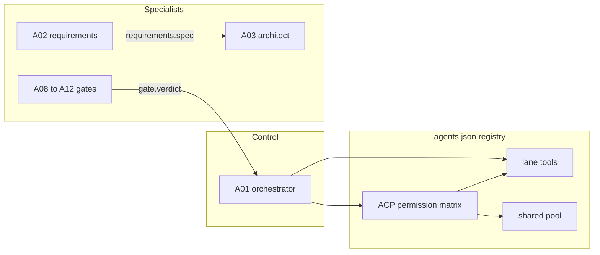

# Architecture overview

AgentSwarm is a 15-agent software-delivery loop. A01 owns the plan. The other agents do one lane each (requirements, architecture, UX, backend, frontend, data, test, review, security, devops, release, observability, maintenance, docs). This page is the map of the three layers added in v2.1. Agent prompts and lane scripts are unchanged.

## Topology

End-to-end trace for one feature:

1. A01 decomposes the brief. `orch_dag_order` orders the task graph. `orch_budget_class` returns the risk budget the planner already uses.
2. A02 checks acceptance text with `req_gwt_check` and may call `shared_verdict` on the finding severities.
3. A03 and A04 publish contracts and tokens. A05 and A06 implement against them and share `shared_toolchain` / `shared_check_plan` (the old `code_checks.py` pair).
4. A08–A12 gates call `shared_verdict`. A denial is UNAUTHORIZED plus an audit row. A passing gate is a `gate.verdict` message A01 already consumes.
5. A11 records the git head with `shared_git_head`. A12 builds the canary steps. A13 computes burn. A peer that never answers is retried, then dead-lettered, and a sick peer is circuit-broken. The caller's own lane tools keep running.

## Tool layer

`agents.json` is the only registry (`tool_contract: swarm.tool.v1`). Each agent has `registered_tools`. Cross-lane operations live in top-level `shared_tools`. `python3 -m swarm.tool_registry call` is the only path that imports a handler. An unknown name returns `INVALID_INPUT` and does not import anything. Existing `scripts/*.py` entrypoints still run as they did in v2.0.

Every registered tool ends in exactly one of: SUCCESS, INVALID_INPUT (names the field), UNAUTHORIZED (echoes the caller), DEPENDENCY_UNAVAILABLE, TIMEOUT, or PARTIAL_SUCCESS (includes `completed_fraction`).

## Shared pool

The pool is the set of functions two or more lanes already called, not a quota. The dedup notes are in `.planning/phases/04-shared-tool-pool/04-DEDUP.md`. Current shared tools: `shared_verdict`, `shared_toolchain`, `shared_check_plan`, `shared_git_head`.

## ACP fabric

Agents exchange `acp.v1` envelopes through `swarm/acp.py`. The in-process transport derives endpoints (`inproc://A03`) and the allow list from each agent's `produces` and `consumes`. There is no peer list in code. Default is deny. The signed `swarm.v1` task-store envelopes are a different channel and are not replaced by ACP.

## Where to read next

- Tool catalog and the 15 registry pages: `docs/tools/`
- Envelope, retries, and two worked messages: `docs/acp-topology.md`
- How to add a tool or diagnose a dead peer: `docs/operations-runbook.md`
